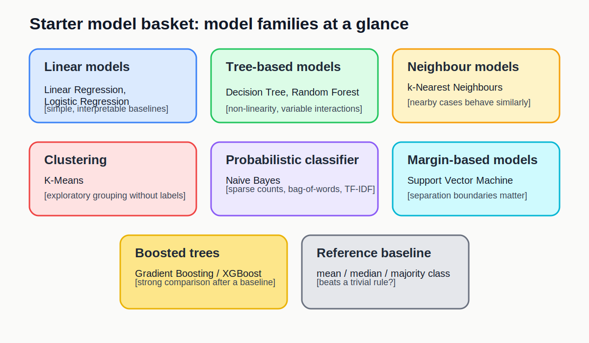
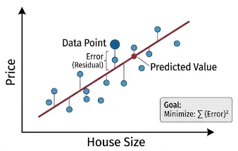
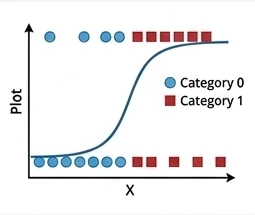
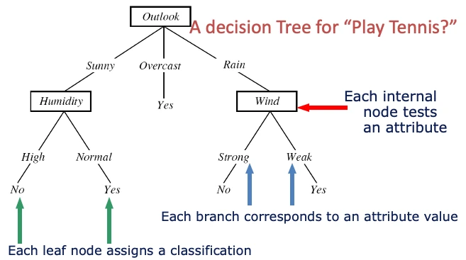
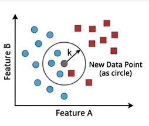
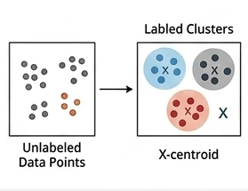
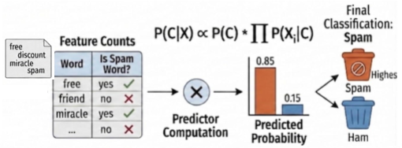
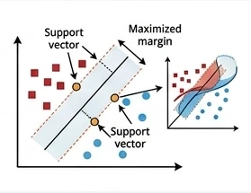
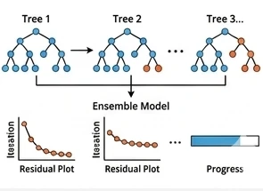

::::::::::::::::::::::::::::::::::::::: objectives

- Define both a trivial reference baseline and a practical model
  basket.
- Choose an initial model based on task type, data shape,
  interpretability, and time available.
- Distinguish between a first baseline model and a stronger comparison
  model.
  
::::::::::::::::::::::::::::::::::::::::::::::::::

:::::::::::::::::::::::::::::::::::::::: questions

- What counts as a sensible baseline or comparison model?
- Which conventional models belong in my starter model basket?

::::::::::::::::::::::::::::::::::::::::::::::::::

## Why start with conventional models

When you first start modelling a real problem, you usually need a
small basket of models that are understandable, quick to run, and easy
to compare.

This lesson is designed to support participant viewing during the workshop.
Use it as a reference while you work through the notebook activities.

Good first choices are driven by four practical questions:

- What task type has already been identified?
- What does the data look like?
- Can you explain the result?
- Can you build and evaluate it today?

For this reason, conventional machine learning is often the right place
to start. It gives you a reference point before you decide whether you
need more complex feature engineering or feature learning.

:::::::::::::::::::::::::::::::::::::::  challenge

## Confirm the modelling goal

Before selecting a model, write down:

- your task type;
- your target or prediction goal;
- what a wrong answer looks like;
- whether interpretability matters.

::::::::::::::::::::::::::::::::::::::::::::::::::

## Two kinds of baseline

It helps to separate two different baseline ideas.

### 1. Trivial reference baseline

This is the simple strategy you should try to beat.

- **Regression:** predict the mean or median every time.
- **Classification:** predict the majority class every time.
- **Clustering:** compare against a simple no-clustering description or
  a very rough grouping.

This step matters because it answers a basic question: is the machine
learning model learning anything useful beyond a trivial rule?

### 2. First machine learning baseline

This is the first real model you build.

{alt="Summary diagram showing the main ideas behind baseline and comparison models in the starter model basket."}


## A model basket

You do not need to try every model. You only need a small set of
sensible options.

### Core starter models

These are the safest first models for most projects at this stage.

- **Linear Regression** for continuous targets when you want a quick,
  interpretable baseline.
- **Logistic Regression** for categorical targets when you want a
  strong, simple classifier.
- **Decision Tree** when interpretability matters or you want to inspect
  simple decision rules.
- **k-Nearest Neighbours** as a useful comparison model when local
  similarity may matter.
- **K-Means** for simple exploratory clustering.

### Useful additions when needed

- **Naive Bayes** for sparse text or count-based text features.
- **Random Forest** when you want a stronger tree-ensemble comparison
  with limited tuning. It combines many trees built in parallel and
  averages their predictions.
- **Support Vector Machine** when margins or high-dimensional spaces may
  matter.
- **XGBoost** or **Gradient Boosting** when you want a stronger
  boosted-tree comparison and have time for the extra setup and tuning.
  Unlike random forests, boosting builds trees in sequence so that each
  new tree tries to correct errors made by the earlier ones.


In most cases, start with the simpler models first. Random forests,
support vector machines, and boosted trees are often more useful as
comparison models after you already have a simple baseline in place.


The sections below are split by model type so they are easier to find
from the lesson index.

## Linear Regression

- Best for: small or medium tabular regression.
- Why start here: quick, interpretable, easy to explain.

<br><strong>Key points:</strong> The model represents the outcome as a weighted sum of the input variables. Learning means adjusting those weights to minimize prediction error on a continuous target.

Docs: [LinearRegression](https://scikit-learn.org/stable/modules/generated/sklearn.linear_model.LinearRegression.html)

## Logistic Regression

- Best for: small or medium tabular classification.
- Why start here: strong baseline with a simple decision boundary.

<br><strong>Key points:</strong> The model uses a weighted combination of the inputs and then applies a logistic function to turn that score into a class probability. Learning means adjusting the weights so the predicted probabilities better match the observed labels, usually by minimizing cross-entropy loss; it can be viewed as a neural network with no hidden layer.

Docs: [LogisticRegression](https://scikit-learn.org/stable/modules/generated/sklearn.linear_model.LogisticRegression.html)


:::::::::::::::::::::::::::::::::::::::  challenge
### Logistic regression beyond binary classification

Logistic regression is often first taught for binary classification.

- Is logistic regression only for binary classification?
- If not, how can it be extended to multiclass classification?
- How is the model learned from the training data?

:::::::::::::::  solution
#### Answer

No. Logistic regression is often introduced first for binary
classification, but it is not limited to only two classes.

For multiclass classification, the output layer can use a softmax
activation so the model produces one probability per class, with those
probabilities summing to 1. In that form, logistic regression becomes a
simple multiclass linear classifier.

The model is learned by adjusting its weights to minimize
cross-entropy loss, usually with a gradient descent based optimization
algorithm. That is the same general optimization idea used when
training neural networks.
:::::::::::::::::::::::::

::::::::::::::::::::::::::::::::::::::::::::::::::

## Decision Tree

- Best for: interpretable tabular problems where simple rules matter.
- Why start here: easy to inspect and discuss.

<br><strong>Key points:</strong> A decision tree represents the model as a sequence of if-then splits. Learning means choosing splits that make the resulting groups purer for classification or more consistent for regression.

Docs: [DecisionTreeClassifier](https://scikit-learn.org/stable/modules/generated/sklearn.tree.DecisionTreeClassifier.html)


:::::::::::::::::::::::::::::::::::::::  challenge
### Decision trees, impurity, and linear boundaries

When fitting a decision tree for classification:

- What does it mean to say that a split makes the child nodes "purer"?
- How can that impurity be measured?
- Is a decision tree a linear classifier?

:::::::::::::::  solution
#### Answer

For classification, a split is useful when it makes the resulting child
nodes contain more cases from a single class than before. In other
words, the split reduces class mixing within each node.

That impurity can be measured in different ways. Two common choices are
Gini impurity and entropy. Both try to quantify how mixed the classes
are inside a node, and the tree algorithm searches for splits that
reduce that impurity as much as possible.

No, a decision tree is not a linear classifier. A linear classifier uses
a single linear boundary in the feature space, while a decision tree
builds a sequence of axis-aligned splits that creates a piecewise,
rule-based decision boundary.

:::::::::::::::::::::::::

::::::::::::::::::::::::::::::::::::::::::::::::::

## k-Nearest Neighbours

- Best for: a simple comparison model when local similarity matters.
- Why start here: gives a useful contrast with linear methods.

<br><strong>Key points:</strong> k-nearest neighbours predicts from the nearest training cases, where “nearest” is defined by a distance measure in the feature space. For classification, it takes a majority vote across the <code>k</code> neighbours; for regression, it can take their average.

Docs: [KNeighborsClassifier](https://scikit-learn.org/stable/modules/generated/sklearn.neighbors.KNeighborsClassifier.html)


:::::::::::::::::::::::::::::::::::::::  challenge
### k-nearest neighbours for regression

k-nearest neighbours is often introduced as a classification method.

- Can it also be used for regression?
- How do we decide which neighbours count as the "nearest" ones?

:::::::::::::::  solution
#### Answer

Yes. For regression, k-nearest neighbours can predict by averaging the
target values of the <code>k</code> nearest neighbours instead of taking a
majority vote.

The "nearest" neighbours are chosen using a distance measure in the
feature space, such as Euclidean distance. That is why scaling can
matter a lot for k-nearest neighbours: variables on larger numeric
scales can otherwise dominate the distance calculation.
:::::::::::::::::::::::::

::::::::::::::::::::::::::::::::::::::::::::::::::

## K-Means

- Best for: exploratory unlabeled grouping.
- Why start here: simple clustering workflow.

<br><strong>Key points:</strong> K-Means represents each cluster by a centre point. Learning means repeatedly assigning cases to the nearest centre and updating the centres until the grouping stabilizes.

Docs: [KMeans](https://scikit-learn.org/stable/modules/generated/sklearn.cluster.KMeans.html)


## Naive Bayes

- Best for: sparse text classification and count-based features.
- Why start here: good simple baseline for bag-of-words style inputs.

<br><strong>Key points:</strong> The model treats features as separate pieces of evidence and combines them probabilistically for each class. Learning mostly means estimating how often features appear within each class from the training data.

Docs: [MultinomialNB](https://scikit-learn.org/stable/modules/generated/sklearn.naive_bayes.MultinomialNB.html)


## Random Forest

- Best for: a stronger tabular comparison after a first baseline.
- Why start here: many trees are averaged together, which usually
  improves stability over a single tree.

Docs: [RandomForestClassifier](https://scikit-learn.org/stable/modules/generated/sklearn.ensemble.RandomForestClassifier.html)

Related docs: [Gradient boosting in scikit-learn](https://scikit-learn.org/stable/modules/ensemble.html#gradient-boosting)


:::::::::::::::::::::::::::::::::::::::  challenge
### Random forests and feature selection

Random forests are often introduced as a stronger tree-based comparison
model.

- Can a random forest be used for feature selection?
- What advantage does a random forest have over a single decision tree?

:::::::::::::::  solution
#### Answer

Yes, a random forest can be used for feature selection in a rough,
practical sense. Because it can estimate feature importance, it can help
you identify variables that seem to contribute more to the predictions.
That said, feature-importance scores are not a perfect or universal
measure, so they should be treated as guidance rather than proof that a
feature is truly important.

The main advantage of a random forest over a single decision tree is
stability. A single tree can change a lot with small changes in the
training data and can overfit easily. A random forest reduces that risk
by fitting many trees on different samples and feature subsets, then
combining their predictions by voting or averaging.
:::::::::::::::::::::::::

::::::::::::::::::::::::::::::::::::::::::::::::::

## Support Vector Machine

- Best for: high-dimensional comparison problems with small to medium
  sample sizes.
- Why start here: can work well when margins and similarity structure
  matter, though it may be slower to fit.
  
<br><strong>Key points:</strong> A support vector machine makes its decision using a small set of key training cases called support vectors, rather than all training points or the nearest neighbours. With a kernel function, it can measure similarity between a new case and those support vectors in a transformed feature space, which is why SVMs are often useful for small-sample, high-dimensional problems, although fitting can become slow because the optimization often involves a large kernel matrix.

Docs: [SVC](https://scikit-learn.org/stable/modules/generated/sklearn.svm.SVC.html)


:::::::::::::::::::::::::::::::::::::::  challenge
### Support vector machines beyond classification

Support vector machines are often introduced as classification models.

- Does an SVM make predictions from all training points?
- What role do the support vectors and kernel function play?
- Can an SVM also be used for regression?
- Why can SVMs become slow to train, and which hyperparameters matter?

:::::::::::::::  solution
#### Answer

An SVM does not usually rely equally on all training points. Its
decision rule is mainly determined by a smaller set of influential cases
called support vectors, which are the training points closest to the
boundary or margin.

The kernel function measures similarity between a new data point and the
support vectors. This lets the model behave as if it were working in a
higher-dimensional feature space, so it can represent more flexible
nonlinear boundaries without explicitly constructing all those new
features. That is one reason SVMs are often used when the sample size is
small but the number of input variables is large.

Yes. SVM ideas can also be used for regression, often called support
vector regression or SVR. Instead of separating classes, the model tries
to fit a function that predicts a continuous outcome while still being
controlled by margin-like ideas and support vectors.

Training can become computationally expensive because kernelized SVMs
often need to compute and optimize over a large kernel matrix that
stores similarities between many pairs of training cases. Important
hyperparameters include <code>C</code>, which controls the trade-off
between margin size and training errors, and any kernel parameters, such
as <code>gamma</code> for an RBF kernel or the degree for a polynomial
kernel.
:::::::::::::::::::::::::

::::::::::::::::::::::::::::::::::::::::::::::::::

## XGBoost

- Best for: a stronger tuned tree-ensemble comparison.
- Why start here: often performs well, but usually needs more tuning
  and setup time.

<br><strong>Key points:</strong> XGBoost represents the model as a sequence of small trees added one after another. Learning means each new tree focuses on the mistakes or residual patterns left by the earlier trees.

Docs: [XGBoost Python package](https://xgboost.readthedocs.io/en/release_3.2.0/python/index.html)

Install note: XGBoost is a separate package rather than part of scikit-learn, so it needs to be installed before use.

:::::::::::::::::::::::::::::::::::::::  challenge
### Random forests versus XGBoost

Random forests and XGBoost are both tree-ensemble methods, so they can
look similar at first.

- What is the main difference between how a random forest and XGBoost
  build their trees?
- Why might XGBoost perform better, but also need more tuning?

:::::::::::::::  solution
#### Answer

The main difference is how the ensemble is built. A random forest grows
many trees independently in parallel on different resampled versions of
the data and different feature subsets, then combines their predictions
by voting or averaging.

XGBoost builds trees sequentially, not independently. Each new tree is
trained to focus on the mistakes or residual patterns left by the
earlier trees, so the model improves step by step.

Because of that sequential boosting strategy, XGBoost can often produce
stronger predictive performance than a random forest. The trade-off is
that it usually has more settings that matter in practice, such as the
learning rate, tree depth, and the number of boosting rounds, so it
often needs more careful tuning.

:::::::::::::::::::::::::

::::::::::::::::::::::::::::::::::::::::::::::::::

### Rule of thumb

Move in this order:

1. define the trivial reference baseline;
2. fit one simple conventional machine learning baseline;
3. only then compare a stronger or more specialised model.

This keeps the lesson focused on what is new at this stage: not
identifying the task type again, but choosing a sensible first model for
that task.

## What not to do

Do not pick a model because it sounds powerful.

Common poor choices include:

- choosing a deep neural network before establishing a baseline;
- comparing many models without a reference point;
- using a complex model that cannot be interpreted or debugged;
- picking a model that does not match the target type.

## When the basket is not enough

If a simple conventional model misses important structure, the next step
is usually one of these:

- improve the features you provide to the model;
- compare a stronger conventional model;
- move to neural networks or transfer learning if the model needs to
  learn features automatically.

That is why the next lessons look at where to search for further
improvement: better engineered features, stronger neural-network
approaches, and feature learning when the model needs to learn useful
representations more automatically.

:::::::::::::::::::::::::::::::::::::::  challenge
## Choose a baseline sequence

Complete the sentence:

"My task is __________, my trivial reference baseline is __________,
and my first ML baseline is __________ because __________."

If you are planning a later development step, add one more line:

"My next justified upgrade would be __________ because __________."

:::::::::::::::  solution
### Example answers

- "My task is regression, my trivial reference baseline is predicting
  the mean house price, and my first ML baseline is Linear Regression
  because the data are tabular and I need an interpretable starting
  point."
- "My task is classification, my trivial reference baseline is the
  majority class, and my first ML baseline is Logistic Regression
  because I want a simple, explainable model before comparing anything
  stronger."
- "My task is sparse text classification, my trivial reference baseline
  is the majority class, and my first ML baseline is Naive Bayes
  because it works well with simple text-count features and is quick to
  test."
:::::::::::::::::::::::::

::::::::::::::::::::::::::::::::::::::::::::::::::

## A minimal Python pattern

The code below shows the structure of a simple baseline process for a
classification task.

If you want a concrete mental model while reading this code, map it to
the worked example on horse blinking: measured input features come in,
the model predicts the blink-related class or outcome, and the baseline
is checked against a trivial reference first.

```python
from sklearn.datasets import load_iris
from sklearn.dummy import DummyClassifier
from sklearn.linear_model import LogisticRegression
from sklearn.metrics import accuracy_score
from sklearn.model_selection import train_test_split

iris = load_iris(as_frame=True)
X = iris.data
y = iris.target

X_train, X_test, y_train, y_test = train_test_split(
    X, y, test_size=0.2, random_state=42, stratify=y
)

reference_model = DummyClassifier(strategy="most_frequent")
reference_model.fit(X_train, y_train)
reference_predictions = reference_model.predict(X_test)

baseline_model = LogisticRegression(max_iter=1000)
baseline_model.fit(X_train, y_train)
baseline_predictions = baseline_model.predict(X_test)

print("Reference accuracy:", accuracy_score(y_test, reference_predictions))
print("Baseline accuracy:", accuracy_score(y_test, baseline_predictions))
```

The point of this example is not the specific score. The point is the
process:

- split the data;
- fit a trivial reference;
- fit a simple baseline;
- compare them with one primary metric.

## Key points

:::::::::::::::::::::::::::::::::::::::: keypoints
- Choose the task type before choosing the algorithm.
- A good starter model basket includes both simple baselines and one or
  two stronger comparison options.
- Conventional models are usually the right first step for structured
  or limited data.
- Stronger models should be added for a reason, not because they sound
  more advanced.
::::::::::::::::::::::::::::::::::::::::::::::::::
