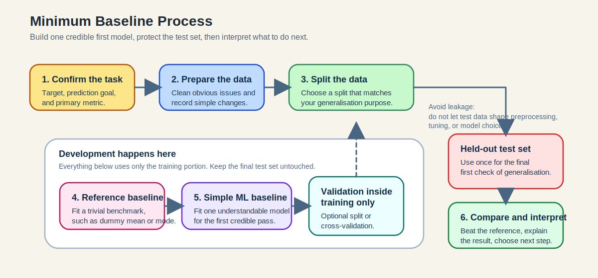

::::::::::::::::::::::::::::::::::::::: objectives
 Explain the minimum workflow for building a credible first baseline.
 Distinguish the roles of training, validation, and test data in that workflow.
 Interpret simple train/test patterns as underfitting, overfitting, or a reasonable fit.
 Decide when cross-validation or a further development step is justified.
::::::::::::::::::::::::::::::::::::::::::::::::::
:::::::::::::::::::::::::::::::::::::::: questions
- What is the minimum process needed to build a baseline model well?
- How do training, validation, test splitting, and cross-validation fit into that process?
- How do early results help you decide on a sensible next development step?
::::::::::::::::::::::::::::::::::::::::::::::::::

Training is not just calling `.fit()`.

The aim in this lesson is to turn model fitting into a small, credible workflow.
The minimum baseline process below shows that workflow step by step.

## The minimum baseline process

Start by confirming the prediction task, target, and primary metric.
Then work through the rest of the baseline process.

{alt="Diagram of the minimum baseline process: confirm task and metric, prepare data, split data, build baselines using only training data, evaluate once on the held-out test set, and interpret the next step."}

### Prepare the data

Use a clean tabular dataset or a simplified version of personal data.

At this stage, simple preparation is enough:

- encode categorical variables if needed;
- scale features if the chosen method needs it;
- remove or flag obviously unusable values;
- keep notes on what you changed.

### Split the data

Splitting is part of the generalisation question, not just a technical
step. Ask what kind of new case the model should work on: new rows from
the same population, later observations, or completely new subjects,
groups, or sites.

Use an 80/20 train/test split as a standard first pass when rows are independent and sampled from the same population. The training set is used to fit and develop the model; the test set is kept back for the
final check.

Choose the split to match the data:

- for ordinary classification, a random split with `stratify=y` is
  often sensible;
- for ordinary regression, a random split is often enough if rows are
  independent;
- for time series, keep time order and test on later data;
- for repeated measures or grouped data, split by subject or group.

In practice:

- the training set is the part the model is allowed to learn from;
- the validation step is where you compare versions or tune settings;
- the test set is the part kept back for the final check;
- avoid leakage: do not let future information, the same person or group, full-dataset preprocessing, or repeated test-set checking shape model development.


### Fit the trivial reference baseline

This provides the lowest bar the machine learning model should beat.

### Fit the simple machine learning baseline

Keep this to one core baseline on the first pass.

### Evaluate on the test set

Use the metric chosen before training. Interpret the result in plain
language before doing anything more advanced.

At this stage, participants should be able to answer three questions in
plain language:

1. Did the ML baseline beat the reference baseline?
2. Is the result good enough to be useful for this first pass?
3. What should be improved next: data, features, model choice, or
  evaluation?

## Underfitting and Overfitting

The goal of training is not just to fit the training set. It is to develop a model that generalises well to new, unseen data.

Generalisation is one of the main concepts in an introductory machine learning lesson.

{alt="Illustration comparing underfitting, reasonable fit, and overfitting curves."}
(Image from scikit-learn documentation: https://scikit-learn.org/stable/auto_examples/model_selection/plot_underfitting_overfitting.html)

### Underfitting

The model is too simple to capture the pattern.

Signal:

- weak performance on training data;
- weak performance on test data.

### Overfitting

The model learns training-specific patterns rather than general
patterns.

Signal:

- strong performance on training data;
- noticeably weaker performance on test data.

### Reasonable fit

The model is not perfect, but performance is consistent enough across
training and test data to be believable.

This is often a more valuable outcome than squeezing out a slightly
better score with a harder-to-explain process.

## Where cross-validation fits

{alt="Diagram showing how cross-validation rotates through multiple train and validation splits."}

Use cross-validation when:

- the dataset is small;
- results vary a lot across splits;
- you are comparing two plausible alternatives;
- you are ready for a slightly more rigorous check.

### Choose the cross-validation strategy to match the data

Cross-validation follows the same rule as train/test splitting: choose
the strategy to match the structure of the data.

- for ordinary classification, stratified k-fold is often helpful
  because each fold keeps a similar class balance;
- for time series, use a time-aware split so the model is always tested
  on later observations;
- for subject-based or grouped data, use group-aware validation so all
  rows from one subject stay together.

In scikit-learn terms, the important idea is not to memorize function
names, but to know that tools such as `TimeSeriesSplit` and
`GroupKFold` exist for these cases.

Cross-validation is not mandatory if it prevents complete
beginners from finishing the core process.

```python
from sklearn.model_selection import cross_val_score

cv_scores = cross_val_score(
    LinearRegression(), X, y, cv=5, scoring="neg_mean_absolute_error"
)

print("Mean CV MAE:", -cv_scores.mean())
```

How should you read this result?

- a single train/test split gives one estimate based on one partition of
  the data;
- cross-validation gives several estimates across different partitions;
- if the cross-validation scores vary a lot, the result is less stable
  and should be interpreted more cautiously.

This is why cross-validation is best taught as a stronger check, not as
the first barrier to entry.

## A simple training example

This example pulls together the baseline process, the holdout split,
and the idea of interpreting results before deciding on a next step.

```python
from sklearn.datasets import load_diabetes
from sklearn.dummy import DummyRegressor
from sklearn.linear_model import LinearRegression
from sklearn.metrics import mean_absolute_error
from sklearn.model_selection import train_test_split

data = load_diabetes(as_frame=True)
X = data.data
y = data.target

X_train, X_test, y_train, y_test = train_test_split(
    X, y, test_size=0.2, random_state=42
)

reference_model = DummyRegressor(strategy="mean")
reference_model.fit(X_train, y_train)
reference_predictions = reference_model.predict(X_test)

baseline_model = LinearRegression()
baseline_model.fit(X_train, y_train)
baseline_predictions = baseline_model.predict(X_test)

print("Reference MAE:", mean_absolute_error(y_test, reference_predictions))
print("Baseline MAE:", mean_absolute_error(y_test, baseline_predictions))
```

This demonstrates the minimum bootcamp pattern:

- use a holdout set;
- compare against a dummy reference;
- report one clear metric.

The interpretation step matters just as much as the code.

For example:

- if the baseline MAE is lower than the reference MAE, the model is
  learning something beyond the trivial benchmark;
- if the improvement is tiny, the next step may be better features
  rather than a more complex model;
- if the improvement is large, the baseline may already be credible
  enough to interpret and communicate.

## Justified further-development pathways

Once you have a credible baseline, the next step should still be
chosen carefully.

### Pathway 1: strengthen the baseline

Best for beginners and many tabular projects.

Typical moves:

- improve preprocessing;
- add one or two engineered features;
- compare against one stronger classical model;
- improve interpretation and documentation.

### Pathway 2: compare a stronger but still manageable model

Best when you already have a credible baseline.

Examples:

- compare logistic regression with a decision tree;
- compare linear regression with a random forest;
- compare a baseline feature set with an engineered feature set.

The key question is not "does this model usually win?" but "does this
comparison answer something useful about this problem?"

### Pathway 3: prototype a representation-aware approach

Best for text, image, signal, sequence, or other specialised data.

Examples:

- sentence embeddings plus a simple classifier;
- transfer learning for image features;
- domain features for signals;
- a prototype architecture choice linked to data structure.

The goal is often a justified prototype plan rather than a complete,
polished implementation.


## Key points

:::::::::::::::::::::::::::::::::::::::: keypoints
- Training in the bootcamp means following a short, reproducible
  process, not just running one line of code.
- A train/test split is the standard first check for generalisation.
- Default model settings may not work well; tuning hyperparameters with validation or cross-validation can help.
- Random and stratified splits are common defaults for ordinary classification, but time series and grouped subject data need different validation strategies.
- Any further development should be justified by the data, the task, and
  the current state of the model and analysis.
::::::::::::::::::::::::::::::::::::::::::::::::::