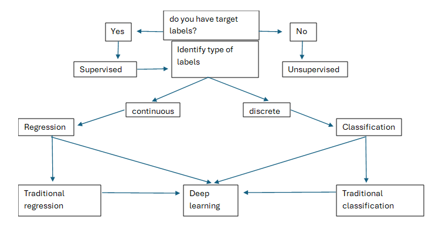
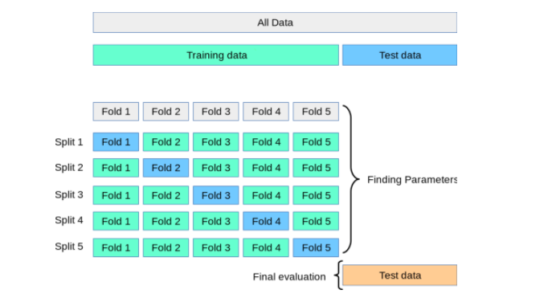

::::::::::::::::::::::::::::::::::::::: objectives
- Run a complete baseline model-building process from data split to
  model fit.
- Distinguish between train, validation, and test thinking at an
  appropriate level for an introductory lesson.
- Use train/test comparison to spot underfitting or overfitting.
- Plan one justified further-development pathway after a baseline
  exists.
::::::::::::::::::::::::::::::::::::::::::::::::::

:::::::::::::::::::::::::::::::::::::::: questions
- What is the minimum process needed to build a baseline model well?
- How do train/test split and cross-validation fit into that process?
- How should you decide on a sensible next development step?
::::::::::::::::::::::::::::::::::::::::::::::::::

## Building a baseline model

Training is not just calling `.fit()`.

This lesson page is the student-facing companion to the live workshop.
Follow it during the practical, then return to it when you need to
remember the order of the steps.

In practice, building a baseline model means moving through a short,
reproducible sequence:

1. confirm the task, target, and primary metric;
2. prepare the data;
3. split into train and test sets;
4. fit a trivial reference baseline;
5. fit one simple machine learning baseline;
6. compare results on unseen data;
7. write a short interpretation and next step.

This is the core baseline process. Once that exists, you can improve it
in a justified way.

## Before fitting any model

Check a few basic points first.

### 1. Is the target clear?

If the target is vague, the model training step will be vague too.

### 2. Is the data clean enough?

The bootcamp does not need perfect preprocessing, but it does need data
that can be used consistently.

Check for:

- missing values;
- inconsistent labels;
- obvious leakage from future or outcome variables;
- severe class imbalance or an uneven target distribution.

### 3. Is the primary metric already chosen?

Do not wait until after training to decide what "good" means.

## The minimum baseline process

{alt="Machine learning pipeline diagram showing the main stages from data to evaluation."}

### Prepare the data

Use a clean tabular dataset or a simplified version of personal data.

At this stage, simple preparation is enough:

- encode categorical variables if needed;
- scale features if the chosen method needs it;
- remove or flag obviously unusable values;
- keep notes on what you changed.

### Split the data

Use an 80/20 train/test split as the standard first pass.

The training set is used to fit the model. The test set is held back so
that you can check whether the model generalises.

In this workshop, most model development happens inside the training
portion of the data. That training portion may then be split again into
training and validation sets, or used with cross-validation, so that
you can compare options and tune the model without touching the final
test set.

For classification, stratification is often useful because it keeps the
class balance similar across train and test sets.

What this means in practice is simple:

- the training set is the part the model is allowed to learn from;
- the validation step is where you compare versions or tune settings;
- the test set is the part kept back for the final first check;
- if the test data influenced model choices too early, the evaluation is
  no longer a fair check of generalisation.

For example, if you had 100 labelled rows and used an 80/20 split, the
model would train on 80 rows and be evaluated on 20 previously unseen
rows.

### Fit the trivial reference baseline

This provides the lowest bar the machine learning model should beat.

### Fit the simple machine learning baseline

Keep this to one core baseline on the first pass.

### Evaluate on the test set

Use the metric chosen before training. Interpret the result in plain
language before doing anything more advanced.

At this stage, participants should be able to answer three questions in
plain language:

1. Did the ML baseline beat the reference baseline?
2. Is the result good enough to be useful for this first pass?
3. What should be improved next: data, features, model choice, or
  evaluation?

:::::::::::::::::::::::::::::::::::::::  challenge
## Baseline check

Before running code, write down your answers to these prompts:

- What is my target?
- What is my primary metric?
- What is my trivial reference baseline?
- What is my first ML baseline?
- What result would count as a meaningful change over the
  reference?
::::::::::::::::::::::::::::::::::::::::::::::::::

## A simple training example

```python
from sklearn.datasets import load_diabetes
from sklearn.dummy import DummyRegressor
from sklearn.linear_model import LinearRegression
from sklearn.metrics import mean_absolute_error
from sklearn.model_selection import train_test_split

data = load_diabetes(as_frame=True)
X = data.data
y = data.target

X_train, X_test, y_train, y_test = train_test_split(
    X, y, test_size=0.2, random_state=42
)

reference_model = DummyRegressor(strategy="mean")
reference_model.fit(X_train, y_train)
reference_predictions = reference_model.predict(X_test)

baseline_model = LinearRegression()
baseline_model.fit(X_train, y_train)
baseline_predictions = baseline_model.predict(X_test)

print("Reference MAE:", mean_absolute_error(y_test, reference_predictions))
print("Baseline MAE:", mean_absolute_error(y_test, baseline_predictions))
```

This demonstrates the minimum bootcamp pattern:

- use a holdout set;
- compare against a dummy reference;
- report one clear metric.

The interpretation step matters just as much as the code.

For example:

- if the baseline MAE is lower than the reference MAE, the model is
  learning something beyond the trivial benchmark;
- if the improvement is tiny, the next step may be better features
  rather than a more complex model;
- if the improvement is large, the baseline may already be credible
  enough to interpret and communicate.

This is the kind of short conclusion participants should be encouraged
to write after every first model run.

## Underfitting and Overfitting

The goal of training is not just to fit the training set. The goal is to develop a model that generalises well to new, unseen data.

This is one of the main interpretive ideas in an introductory machine learning lesson.

{alt="Illustration comparing underfitting, reasonable fit, and overfitting curves."}
(Image from scikit-learn documentation: https://scikit-learn.org/stable/auto_examples/model_selection/plot_underfitting_overfitting.html)

### Underfitting

The model is too simple to capture the pattern.

Signal:

- weak performance on training data;
- weak performance on test data.

### Overfitting

The model learns training-specific patterns rather than general
patterns.

Signal:

- strong performance on training data;
- noticeably weaker performance on test data.

### Reasonable fit

The model is not perfect, but performance is consistent enough across
training and test data to be believable.

This is often a more valuable outcome than squeezing out a slightly
better score with a harder-to-explain process.

## Where cross-validation fits

{alt="Diagram showing how cross-validation rotates through multiple train and validation splits."}

Cross-validation should be presented as an extension, not a barrier.

For beginners, a train/test split is enough for a first baseline.
For more confident participants, 5-fold cross-validation can provide a more
stable estimate of performance.

Use cross-validation when:

- the dataset is small;
- results vary a lot across splits;
- you are comparing two plausible alternatives;
- you are ready for a slightly more rigorous check.

Do not make cross-validation mandatory if it prevents complete
beginners from finishing the core process.

```python
from sklearn.model_selection import cross_val_score

cv_scores = cross_val_score(
    LinearRegression(), X, y, cv=5, scoring="neg_mean_absolute_error"
)

print("Mean CV MAE:", -cv_scores.mean())
```

How should you read this result?

- a single train/test split gives one estimate based on one partition of
  the data;
- cross-validation gives several estimates across different partitions;
- if the cross-validation scores vary a lot, the result is less stable
  and should be interpreted more cautiously.

This is why cross-validation is best taught as a stronger check, not as
the first barrier to entry.

## Justified further-development pathways

Once you have a credible baseline, the next step should still be
chosen carefully.

### Pathway 1: strengthen the baseline

Best for beginners and many tabular projects.

Typical moves:

- improve preprocessing;
- add one or two engineered features;
- compare against one stronger classical model;
- improve interpretation and documentation.

### Pathway 2: compare a stronger but still manageable model

Best when you already have a credible baseline.

Examples:

- compare logistic regression with a decision tree;
- compare linear regression with a random forest;
- compare a baseline feature set with an engineered feature set.

The key question is not "does this model usually win?" but "does this
comparison answer something useful about this problem?"

### Pathway 3: prototype a representation-aware approach

Best for text, image, signal, sequence, or other specialised data.

Examples:

- sentence embeddings plus a simple classifier;
- transfer learning for image features;
- domain features for signals;
- a prototype architecture choice linked to data structure.

The goal is often a justified prototype plan rather than a complete,
polished implementation.

{alt="Penguin dataset image that can be used as a concrete example for a student-friendly modelling task."}

## Upgrade planning template

Before you implement a larger development step, complete the following:
- What I have now
- What I will change next
- Why this is the right next step
- What evidence would show that the change is useful
- What limitation or constraint might block the plan

:::::::::::::::::::::::::::::::::::::::  challenge
## Choose a justified next step

Pick one possible further development and justify it in two sentences.

Your answer should include:

- the current weakness in the baseline;
- the specific development step you will try;
- the evidence you would expect if it helps or clarifies the problem.

:::::::::::::::  solution
## Example answer

"My baseline classification model is missing important domain structure,
so I will add two engineered features before trying a more complex
algorithm. I would expect this to improve recall on the minority class
without making the process much harder to explain."
:::::::::::::::::::::::::
::::::::::::::::::::::::::::::::::::::::::::::::::

## Mixed-ability teaching guidance

### Supported starter path

Success means:

- a completed notebook;
- a train/test split;
- one reference baseline;
- one simple ML baseline;
- one metric and one plain-language interpretation.

### Applied research path

Success means:

- training on personal data;
- sensible preprocessing;
- justified metric choice;
- one comparison or one clear next development step.

### Stretch path

Success means:

- a credible baseline or prototype;
- a documented comparison or architecture decision;
- explicit limits, assumptions, and next steps.

## Key points

:::::::::::::::::::::::::::::::::::::::: keypoints
- Training in the bootcamp means following a short, reproducible
  process, not just running one line of code.
- A train/test split is the standard first check for generalisation.
- Cross-validation is useful, but it should be introduced in proportion
  to participant confidence and dataset size.
- Any further development should be justified by the data, the task, and
  the current state of the model and analysis.
::::::::::::::::::::::::::::::::::::::::::::::::::