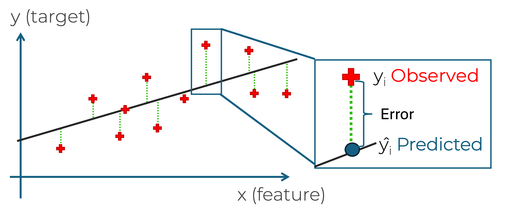
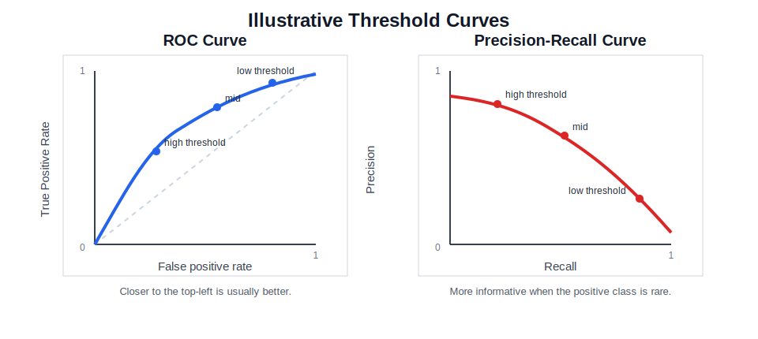

::::::::::::::::::::::::::::::::::::::: objectives
- Choose one primary metric that matches the task and the cost of error.
- Interpret train/test results using simple diagnostics.
- Use task-appropriate evaluation views such as residuals or confusion
  matrices.
- Document limitations, subgroup concerns, and responsible claims.
::::::::::::::::::::::::::::::::::::::::::::::::::

:::::::::::::::::::::::::::::::::::::::: questions
- Which metric should I choose before training a model?
- How do I tell whether a model is useful, overfit, or misleading?
- How do I evaluate results responsibly and communicate them clearly?
::::::::::::::::::::::::::::::::::::::::::::::::::

## Evaluation starts before the model is trained

The evaluation metric should be chosen
before training. If you wait until after seeing the results, it becomes too easy to
switch to whichever metric looks best.

Final evaluation should also be planned before model tuning begins. If possible, leave an independent test set untouched during model
development, and use only training and validation data to choose or adjust the model. That way, the final test result is a more honest check of generalisation.

The first evaluation question is therefore not "what score did I get?"
It is "what kind of error matters in this problem?"

## Why evaluation needs context

A model can sound impressive on paper and still fail badly in practice.

For example, an automated sports camera may report high tracking
accuracy during testing, but still fail in a real match if it follows
the wrong object when conditions change. In that case, the headline
score hides the fact that the system is not solving the real problem in
context.

That is why evaluation should always connect three things:

- the metric;
- the kind of mistake being made;
- the real use of the model.

## Choosing a primary metric

### Regression

<div style="background: white; padding: 12px; border-radius: 8px; display: inline-block;">

</div>

- **MAE** measures average absolute error and is often the easiest to
  explain.
- **RMSE** penalises large errors more strongly.
- **R^2** summarises explained variance but is often overinterpreted.

### What the regression metrics actually compute

$$
\mathrm{MAE} = \frac{1}{n} \sum_{i=1}^{n} |y_i - \hat{y}_i|
$$

$$
\mathrm{RMSE} = \sqrt{\frac{1}{n} \sum_{i=1}^{n} (y_i - \hat{y}_i)^2}
$$

$$
R^2 = 1 - \frac{\sum_{i=1}^{n} (y_i - \hat{y}_i)^2}{\sum_{i=1}^{n} (y_i - \bar{y})^2}
$$

Interpretation:

- MAE tells you the average absolute size of the error in the original
  units;
- RMSE penalises large errors more strongly because errors are squared
  before averaging;
- $R^2$ compares the model against a simple mean-value baseline and
  measures how much of the variation in the target is captured by the
  model;
- if RMSE is much larger than MAE, a few large mistakes may be driving
  the result.

### Classification

- **Accuracy** is simple, but can be misleading with imbalance.
- **Precision** matters when false positives are costly.
- **Recall** (True Positive Rate, or Sensitivity) matters when false negatives are costly.
- **F1 score** balances precision and recall when both matter.

For a first pass, commit to one main metric and explain why your problem makes that metric sensible.

### What the classification metrics actually mean

For a binary problem, start from the confusion matrix:

- true positives (TP): predicted positive and actually positive;
- false positives (FP): predicted positive but actually negative;
- false negatives (FN): predicted negative but actually positive;
- true negatives (TN): predicted negative and actually negative.

Then:

$$
\mathrm{Accuracy} = \frac{TP + TN}{TP + TN + FP + FN}
$$

$$
\mathrm{Precision} = \frac{TP}{TP + FP}
$$

$$
\mathrm{Recall} = \frac{TP}{TP + FN}
$$

$$
\mathrm{F1} = 2 \times \frac{\mathrm{Precision} \times \mathrm{Recall}}{\mathrm{Precision} + \mathrm{Recall}}
$$

Interpretation:

- use accuracy when classes are reasonably balanced and the main goal is
  overall correctness;
- use precision when false positives are costly;
- use recall when missing a positive case is costly;
- use F1 when both precision and recall matter and you want one summary
  number.

### Thresholds, ROC curves, and precision-recall curves

Many classifiers do not only output a label. They also output a score
or probability, and a threshold then turns that score into a final
class.

For example, you might label a case as positive when the model gives a
probability above 0.5. But that threshold is a choice. Changing it
changes the trade-off between false positives and false negatives.

- **ROC curve**: shows the trade-off between true positive rate and
  false positive rate across thresholds;
- **precision-recall curve**: shows the trade-off between precision and
  recall across thresholds, and is especially useful when the positive
  class is rare.

**ROC-AUC** summarises the ROC curve into one number: the larger the
area, the better the model is at separating positive and negative cases
across many thresholds.

**PR-AUC** summarises the precision-recall curve into one number. A
higher PR-AUC means the model does a better job of keeping precision
high while also recovering more of the true positive cases.

{alt="Side-by-side illustrative ROC and precision-recall curves showing how threshold changes move model performance."}

In general:

- if classes are fairly balanced, ROC can be a reasonable overview;
- if the positive class is rare or especially important, the
  precision-recall curve is often more informative.

These curves are best treated as an extension once students already
understand the confusion matrix and the precision-recall trade-off.

```python
from sklearn.metrics import PrecisionRecallDisplay, RocCurveDisplay

RocCurveDisplay.from_predictions(y_test, y_score)
PrecisionRecallDisplay.from_predictions(y_test, y_score)
```

In other words, a classifier is not always one fixed answer. Sometimes
it is a scoring system, and evaluation helps you decide where to place
the decision boundary.

### Clustering

- **Inertia** describes how tightly grouped the clusters are.
- **Silhouette score** gives a rough sense of separation between
  clusters.

These scores should be treated as rough guides. In many real projects,
the more important question is whether the grouping is useful for the
scientific or operational purpose.

## A small worked example before coding

Before opening a notebook, it helps to see what these metrics mean on a tiny example.

### Classification example

Suppose a model predicts whether a sample is positive or negative, and the results are:

| | Predicted positive | Predicted negative |
| --- | --- | --- |
| Actual positive | 8 | 2 |
| Actual negative | 3 | 7 |

So:

- $TP = 8$
- $FN = 2$
- $FP = 3$
- $TN = 7$

Then:

- accuracy $= \frac{8 + 7}{20} = 0.75$
- precision $= \frac{8}{8 + 3} \approx 0.73$
- recall $= \frac{8}{8 + 2} = 0.80$

Interpretation:

- the model is correct 75% of the time overall;
- when it predicts positive, it is right about 73% of the time;
- it finds 80% of the truly positive cases.


## When false positives and false negatives have different costs

Imagine a model that predicts whether a patient should be flagged for
further medical review.

| | Predicted review needed | Predicted no review needed |
| --- | --- | --- |
| Actually needs review | True positive | False negative |
| Actually does not need review | False positive | True negative |

That means:

- a **true positive** is a patient correctly flagged for review;
- a **false negative** is a patient who needed review but was missed;
- a **false positive** is a patient flagged for review who did not
  really need it;
- a **true negative** is a patient correctly left unflagged.

This example is useful because the trade-off between recall and
precision is easier to explain:

- if a false negative is costly because a concerning case is missed,
  then **recall** matters;
- if a false positive is costly because follow-up is expensive or
  disruptive, then **precision** matters;
- if you need a balance between the two, **F1** may be a useful summary.

This is much more useful than saying only that the model got, for
example, 70% accuracy. We can now ask the better question: what kind of
mistake is the model making most often, and which kind matters more?


### Regression example

Suppose the true values are:

$$
[10, 12, 9, 15]
$$

and the model predicts:

$$
[11, 10, 8, 16]
$$

Then the absolute errors are:

$$
[1, 2, 1, 1]
$$

so:

$$
\mathrm{MAE} = \frac{1 + 2 + 1 + 1}{4} = 1.25
$$

Interpretation:

- on average, the model is wrong by about 1.25 units;
- if that size of error is acceptable in context, the baseline may be
  useful;
- if that size of error is too large, better features or a different
  model may be needed.

Once you have a result, the next step is to judge whether the pattern of
performance is believable.

## Task-specific evaluation views

### Regression: look at residuals

Residuals are the differences between predicted and true values.

Ask:

- Are the errors roughly spread out?
- Are there obvious large-error cases?
- Do the errors get worse in a particular region?

Check:

- if residuals are roughly centred around zero, the model is not showing
  a clear one-direction bias;
- if residual spread gets larger for bigger predictions, the model may
  behave worse in one region of the target range;
- if a few points sit far away from the rest, there may be outliers or
  important subgroups to inspect.

```python
import matplotlib.pyplot as plt
from sklearn.metrics import mean_absolute_error

errors = y_test - baseline_predictions

print("MAE:", mean_absolute_error(y_test, baseline_predictions))

plt.scatter(baseline_predictions, errors)
plt.axhline(0, color="black", linestyle="--")
plt.xlabel("Predicted value")
plt.ylabel("Residual")
plt.show()
```

### Classification: inspect the confusion matrix

Accuracy alone hides what kinds of mistakes are being made.

Use a confusion matrix to ask:

- Where are the false positives?
- Where are the false negatives?
- Are the errors acceptable for this context?


```python
from sklearn.metrics import ConfusionMatrixDisplay, classification_report

ConfusionMatrixDisplay.from_predictions(y_test, baseline_predictions)
print(classification_report(y_test, baseline_predictions))
```

### Clustering: inspect whether the groups are meaningful

For clustering, do not stop at inertia or silhouette score.

Ask:

- Do the groups have an interpretable story?
- Does changing the number of clusters change the story completely?
- Is the grouping useful for a downstream task or research question?


## What your metric is not telling you

Do not treat one score as the whole truth.

A model can have a good headline metric and still be weak because:

- it only works for the majority group;
- it fails badly on a small but important subset;
- it is too brittle to trust;
- it cannot be explained to the people who need to use it.

So it can be useful to ask not only "how good is the score?" but also
"what is the model using to make this prediction?"

For simpler models, this can be quite direct:

- in a linear model, you can inspect feature coefficients;
- in a tree-based model, you can look at splits or feature importance;
- in many models, you can vary one input and see how the prediction
  changes.

For more complex models, explanation is usually more approximate.

- tools such as [LIME](https://lime.readthedocs.io/en/latest/) and
  [SHAP](https://shap.readthedocs.io/en/latest/) try to explain which inputs were influential for a prediction or across the model as a
  whole.

{alt="SHAP example figure showing how feature contributions can explain a prediction."}


## Proportionate responsible evaluation

At some point you need to move beyond score-only thinking.

### Responsible review questions

Ask yourself:

- Who is represented in the dataset?
- Who may be missing?
- What kinds of mistakes matter most?
- What should I avoid claiming from these results?
- What future checks would increase trust?

### Subgroup review when feasible

If meaningful subgroup labels exist, you can compare performance across groups.

If subgroup review is not possible, they should say why:

- required labels may be missing;
- sample sizes may be too small;
- collecting such labels may itself raise ethical concerns.

The important step is documenting the limitation rather than pretending
the issue does not exist.


## Evaluation metric is not always the training loss

One subtle but important idea is that the quantity used to evaluate a model is not always the same as the quantity the learning algorithm tries to minimise during training.

For example:

- a linear regression model may be trained by minimising squared error,
  but later reported using MAE;
- a logistic classifier may be trained by minimising cross-entropy loss,
  but later discussed using accuracy, precision, or recall;
- a neural network may optimise a differentiable loss function during
  training, while the final scientific or operational judgement is made
  with a task-specific evaluation metric.

Why does this happen?

- the training loss must work well for optimisation;
- the evaluation metric must match the real goal of the problem;
- those two goals are related, but they are not always identical.

This is another reason to choose the evaluation metric before training: 
the model should be judged by what matters in practice, not only by what was easiest to optimise.

:::::::::::::::::::::::::::::::::::::::  challenge
## Loss function or evaluation metric?

For each example below, decide whether it describes a training loss, an
evaluation metric, or both.

- cross-entropy used to fit a classifier;
- accuracy reported on the test set;
- mean squared error used to fit a regression model;
- MAE reported to explain average prediction error in the original
  units.

Why might someone deliberately choose different quantities for training
and final evaluation?

:::::::::::::::  solution
### Example answer

- cross-entropy used to fit a classifier: training loss;
- accuracy reported on the test set: evaluation metric;
- mean squared error used to fit a regression model: training loss, and sometimes also an evaluation metric;
- MAE reported to explain average prediction error in the original units: evaluation metric.

The reason for separating them is that optimisation and interpretation do not always need the same quantity. A training loss should help the algorithm learn effectively, while an evaluation metric should reflect what success means in the real problem.
:::::::::::::::::::::::::
::::::::::::::::::::::::::::::::::::::::::::::::::

## Useful scikit-learn references

Students often understand the idea in the lesson, but then get stuck on
the exact function name in code. It helps to give them a short route map
to the metric tools they are most likely to need.

- [Metrics and scoring user guide](https://scikit-learn.org/stable/modules/model_evaluation.html)
- [ConfusionMatrixDisplay](https://scikit-learn.org/stable/modules/generated/sklearn.metrics.ConfusionMatrixDisplay.html)
- [classification_report](https://scikit-learn.org/stable/modules/generated/sklearn.metrics.classification_report.html)
- [accuracy_score](https://scikit-learn.org/stable/modules/generated/sklearn.metrics.accuracy_score.html)
- [precision_score](https://scikit-learn.org/stable/modules/generated/sklearn.metrics.precision_score.html)
- [recall_score](https://scikit-learn.org/stable/modules/generated/sklearn.metrics.recall_score.html)
- [f1_score](https://scikit-learn.org/stable/modules/generated/sklearn.metrics.f1_score.html)
- [mean_absolute_error](https://scikit-learn.org/stable/modules/generated/sklearn.metrics.mean_absolute_error.html)
- [mean_squared_error](https://scikit-learn.org/stable/modules/generated/sklearn.metrics.mean_squared_error.html)
- [r2_score](https://scikit-learn.org/stable/modules/generated/sklearn.metrics.r2_score.html)
- [RocCurveDisplay](https://scikit-learn.org/stable/modules/generated/sklearn.metrics.RocCurveDisplay.html)
- [PrecisionRecallDisplay](https://scikit-learn.org/stable/modules/generated/sklearn.metrics.PrecisionRecallDisplay.html)


## Key points

:::::::::::::::::::::::::::::::::::::::: keypoints
- Choose the primary metric before training, not after seeing the
  result.
- Use residuals, confusion matrices, or cluster interpretation to look
  beyond a single headline score.
- Responsible evaluation means documenting who may be missing, what
  errors matter, and what claims the evidence can support.
::::::::::::::::::::::::::::::::::::::::::::::::::