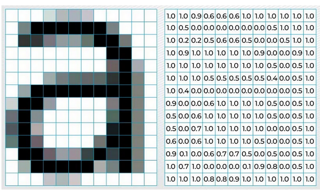
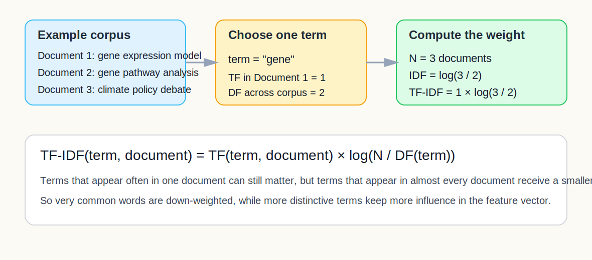
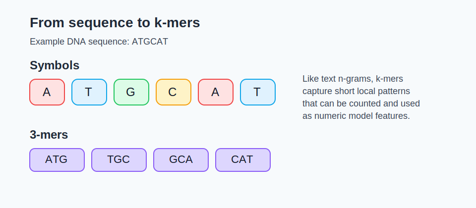
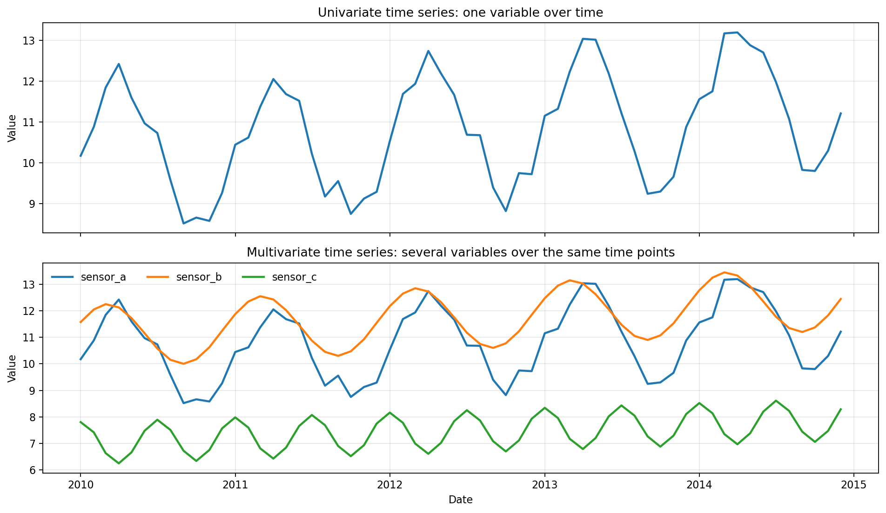

::::::::::::::::::::::::::::::::::::::: objectives
- Explain why the representation of the data often matters as much as
  the choice of model.
- Identify common feature-engineering strategies for tabular, text,
  vision, time-series, spectral, and bioinformatics tasks.
- Choose one or two realistic feature ideas to test on your own
  problem.
::::::::::::::::::::::::::::::::::::::::::::::::::

:::::::::::::::::::::::::::::::::::::::: questions
- What is feature engineering and why does it matter?
- How do features differ across tabular, text, image, time-series, and
  spectral problems?
- What simple task-specific features can I try before training a more
  complex model?
::::::::::::::::::::::::::::::::::::::::::::::::::

## Why feature engineering often comes next

Choosing a model is only part of the job. The model can only learn from
the information you give it.

Feature engineering means creating or selecting inputs that make useful
patterns easier for a model to detect.

In the teaching sequence here, feature engineering usually comes after
you have already chosen a sensible baseline, trained it, and evaluated
its first results. That gives you a clearer reason to change the
representation instead of changing things blindly.

In many real projects, a better representation can improve results more
than switching to a more complex algorithm.

If you want a concise external overview, see the
[scikit-learn feature extraction guide](https://scikit-learn.org/stable/modules/feature_extraction.html).

## A simple way to think about features

- A **raw input** is the data as collected.
- A **feature** is a version of the data that helps a model detect a
  useful pattern.
- A **representation** is the overall way the problem is encoded for the
  model.

## Tabular features

Tabular problems often benefit from small, high-value changes.

Common ideas include:

- ratios and rates;
- interaction terms;
- log transforms;
- binned variables;
- domain flags such as "high risk" or "weekend";
- grouping rare categories.

Ask:

- What would a domain expert would use?
- Which two columns together tell a stronger story than either alone?
- Would the model benefit from a variable being grouped or scaled?

## Vision features

Images are arrays of pixel values, but raw pixels are not always the
best first representation for a small project.

{alt="Illustration showing how image information is stored as pixel values."}

Useful starter strategies include:

- resizing images to a consistent shape;
- converting to grayscale when colour is not central;
- simple summary statistics such as colour distributions;
- dimensionality reduction of pixel features, for example with PCA;
- hand-crafted descriptors such as edges or texture;
- transfer-learning features from a pre-trained vision model.

If you have limited data, precomputed or pre-trained features are often
more realistic than training a large deep model from scratch.

If your first baseline uses raw pixel intensities, PCA can be a
reasonable next step because it compresses the image into a smaller set
of directions that capture large sources of variation. That can make a
classical model easier to train and visualise, even though the new
components are less directly interpretable than the original pixels.

In the starter notebook, the first vision scaffold uses
[Pillow](https://python-pillow.org/) to load, resize, and convert
images, then extracts simple summary features with NumPy. If you want
richer classical descriptors later, a common next library is
[scikit-image](https://scikit-image.org/) and its
[feature module](https://scikit-image.org/docs/stable/api/skimage.feature.html).

## Text features

Text usually cannot go straight into a conventional model in raw form.
It first needs a representation.

Common starter features include:

- bag-of-words counts;
- [TF-IDF](https://scikit-learn.org/stable/modules/feature_extraction.html#tfidf-term-weighting) features;
- document length;
- counts of domain-specific keywords;
- precomputed embeddings, for example [Word2Vec](https://code.google.com/archive/p/word2vec/), [GloVe](https://nlp.stanford.edu/projects/glove/), [fastText](https://fasttext.cc/), or [sentence-transformers](https://www.sbert.net/).

For many participants, TF-IDF plus Logistic Regression or Naive Bayes
is an excellent first baseline.

In the starter notebook, the text section uses
[TfidfVectorizer](https://scikit-learn.org/stable/modules/generated/sklearn.feature_extraction.text.TfidfVectorizer.html)
from scikit-learn.

Precomputed embeddings are useful when you want a richer representation
of meaning without training a large language model from scratch. Instead
of representing a document only as counts of words, embeddings map words
or sentences into numeric vectors where similar meanings are closer
together.

### A concrete TF-IDF example

Suppose you want to classify abstracts into topic areas. Raw sentences
are hard for a conventional model to use directly, but you can convert
them into features such as:

- counts of words like "cancer", "climate", or "genome";
- TF-IDF scores that highlight terms that are informative in one
  document but not common everywhere.

One simple way to write TF-IDF is:

$$
\mathrm{TF\text{-}IDF}(t, d) = \mathrm{TF}(t, d) \times \log\left(\frac{N}{\mathrm{DF}(t)}\right)
$$

where:

- $t$ is a term;
- $d$ is the current document;
- $\mathrm{TF}(t, d)$ is how often the term appears in that document;
- $N$ is the total number of documents in the corpus;
- $\mathrm{DF}(t)$ is the number of documents that contain the term.

The intuition is simple:

- words that appear often in one document may be useful;
- words that appear in nearly every document are less informative;
- TF-IDF keeps the first signal and down-weights the second.

This helps reduce the impact of extremely common words such as "the",
"a", or other corpus-wide filler words that would otherwise dominate the
model simply because they appear everywhere.

An illustrative computation for one term is shown below.

{alt="Diagram showing one simple TF-IDF calculation for the term gene across a small corpus."}

If you need a little local context beyond single words, n-grams can
still be useful as an optional extension, but TF-IDF is often the
cleaner first concept to teach in an introductory workshop.

## Bioinformatics and genomics features

Biological sequences create the same representation challenge as text:
raw strings are difficult for conventional models to use without being
turned into features first.

If you want practical sequence-handling tools later, useful Python
starting points include [Biopython](https://biopython.org/) for sequence
workflows and [scikit-learn](https://scikit-learn.org/stable/) for the
downstream baseline models.

### k-mers as the sequence counterpart to n-grams

A k-mer is a short sequence fragment of length $k$.

Examples:

- for DNA, 3-mers might include `ATG`, `TGC`, or `GCA`;
- for proteins, 2-mers or 3-mers can capture short amino-acid patterns.

Like n-grams in text, k-mer counts or frequencies capture short local
patterns in a sequence.

For example, the DNA sequence `ATGCAT` contains the 3-mers:

- `ATG`
- `TGC`
- `GCA`
- `CAT`

{alt="Diagram showing how a DNA sequence is split into symbols and 3-mers."}

You can turn these into numeric features by counting how often each
k-mer appears, or by using frequencies rather than raw counts.

### Other useful genomics-style features

Depending on the problem, helpful sequence or molecular features might
include:

- GC content;
- sequence length;
- motif presence or absence;
- counts of biologically meaningful subsequences;
- one-hot encoded sequence positions;
- known marker presence such as SNPs, mutation indicators, or selected
  marker panels;
- gene-expression summaries or pathway-level aggregates;
- embedding vectors from a pre-trained biological foundation model.

### Marker-style features

Many biological problems already have features that act a bit like
domain keywords in text.

Examples:

- a mutation is present or absent;
- a particular SNP genotype is encoded, for example as `0`, `1`, or `2`
  copies of the variant allele;
- a gene is highly expressed or not;
- a marker panel is positive or negative;
- a known motif occurs in the sequence.

These are often strong starter features because they connect directly to
domain interpretation.

For example, in a genomics dataset you might use a small set of known
SNPs as marker-style features alongside broader sequence features such
as k-mer frequencies or GC content.

## Time-series and spectral features

Time-series, sensor, and spectral tasks often benefit from features that
capture order, local change, and broader patterns across a measured
signal.

Here, a time series means a variable measured in sequence over time,
such as daily demand, monthly temperature, or repeated sensor readings.
The same ideas also extend to multivariate time series, where several
variables are recorded together over time.

{alt="Illustration comparing a univariate time series with one measured variable over time and a multivariate time series with several variables recorded over the same time points."}

The top panel shows a univariate time series with one measured variable.
The bottom panel shows a multivariate time series where several related
variables are recorded over the same timeline.

Common starter features include:

- lag features;
- [rolling means or rolling standard deviations](https://pandas.pydata.org/docs/reference/api/pandas.DataFrame.rolling.html);
- differences or growth rates;
- [day-of-week, month, or season indicators](https://pandas.pydata.org/docs/reference/api/pandas.Series.dt.html);
- peak counts, slopes, or summary statistics over a time window;
- Fourier or frequency-style summaries when periodic structure matters.

In the starter notebook, these time features are created with
[pandas datetime accessors](https://pandas.pydata.org/docs/reference/api/pandas.Series.dt.html)
and [rolling-window operations](https://pandas.pydata.org/docs/reference/api/pandas.DataFrame.rolling.html).

For spectral data such as NIRS, mass spectrometry, or other measured
signals across wavelength or frequency, many of the same ideas still
apply. The axis is not time, but it is still ordered, so neighbouring
values carry related information.

That means similar feature ideas can be useful, for example:

- smoothing;
- first differences or derivatives;
- peak height, peak position, or peak area;
- summaries over selected wavelength or frequency ranges;
- transformed versions of the signal when shape matters more than raw
  magnitude.

The key teaching idea is that time series and spectra are both ordered
signals. In both cases, feature engineering often tries to capture
local trend, local change, and broader structure rather than treating
every position as an unrelated column. This transfer is illustrated in
the notebook [demo_feature_engineering_timeseries_spectra.ipynb](files/notebooks/demo_feature_engineering_timeseries_spectra.ipynb).

## Features for specialised scientific data

Some scientific problems need features that come from domain knowledge
or specialised analysis methods, not just generic preprocessing.

The earlier sections already covered text, genomics, vision, and
ordered signals. Here are a few other common sources of engineered
features in scientific work:

Common sources include:

- signal-processing features such as filtered signals, Fourier or
  wavelet transforms, derivatives, and peak summaries;
- graph or network features such as node degree, centrality,
  neighbourhood summaries, community labels, or graph embeddings;
- statistical summaries such as moments, quantiles, slopes,
  correlations, or variability measures computed over windows, regions,
  or groups;
- mathematical transforms such as log transforms, ratios,
  normalisations, PCA components, other dimensionality reduction
  scores, or basis-function coefficients;
- chemical or molecular descriptors such as molecular fingerprints,
  substructure counts, graph descriptors, or physicochemical
  properties;
- biological aggregation features such as pathway scores, marker-panel
  summaries, or outputs from domain-specific pipelines;
- embeddings or latent features from pre-trained domain-specific
  foundation models.

The key question is not "what is the fanciest feature?" It is "what representation makes the real structure of this problem easier to detect?" In practice, that often means borrowing a useful summary from signal processing, graph analysis, statistics, mathematics, chemistry, or another domain-specific workflow.

::::::::::::::::::::::::::::::::::::::  challenge
## Pick one feature change
Choose one concrete feature idea for your own problem and write:

- the raw input you currently have;
- the feature you could create;
- why that feature might make the pattern easier to learn.

:::::::::::::::  solution
### Example answers

- "I have daily sales totals, and I could add day-of-week as a feature
  because the pattern probably differs between weekdays and weekends."
- "I have free-text comments, and I could use TF-IDF because the model
  needs a numeric representation of the words before classification."
- "I have DNA sequences, and I could use 4-mer frequencies because the
  model needs a numeric summary of local sequence patterns before
  classification."
- "I have gene-expression data, and I could aggregate genes into pathway
  scores because that may capture biology more directly than thousands
  of separate raw columns."
:::::::::::::::::::::::::

::::::::::::::::::::::::::::::::::::::::::::::::::

## When to stop engineering by hand

Hand-crafted features are powerful, but they are not always enough.
When the data are highly unstructured, the model may need to learn its
own internal representation. That is where neural networks and transfer
learning become useful.

## Feature planning cheat sheet

These are starting points to try, not universally best choices. The
right model still depends on the task, data size, feature quality, and
evaluation results.

| Task type | Starter feature ideas | Possible starter models |
| --- | --- | --- |
| Tabular | ratios, flags, bins, interactions | Linear or Logistic Regression, tree-based models |
| Vision | resize, grayscale, raw pixels plus PCA, summary descriptors, transfer features | Logistic Regression on extracted features, transfer learning later |
| Text | TF-IDF, keyword counts, embeddings | Naive Bayes, Logistic Regression |
| Genomics / sequence data | k-mers, motif counts, GC content, marker presence | Logistic Regression, tree-based models |
| Time series | lags, rolling summaries, seasonal indicators | Linear Regression, tree-based models |
| Spectral / ordered signals | smoothing, derivatives, peak summaries, band averages | Linear Regression, PLS, tree-based models |
| Graph / network data | degree, centrality, neighbourhood summaries, graph embeddings | Logistic Regression or tree-based models on node features |

## Key points

:::::::::::::::::::::::::::::::::::::::: keypoints
- Better features often improve a model more than switching to a more
  complex algorithm.
- Different task types need different representations.
- Text, images, and time series usually need task-specific feature
  extraction before a conventional baseline makes sense.
- Spectral data and time-series data are often similar from a feature
  engineering perspective because both are ordered signals.
- TF-IDF is useful because it reduces the influence of very common words
  and highlights terms that are more informative for a particular
  document.
- Genomics and bioinformatics data often need sequence or marker-based
  features such as k-mers, motifs, SNP markers, or pathway summaries.
- Feature engineering and feature learning sit on the same continuum of
  representation choices.
::::::::::::::::::::::::::::::::::::::::::::::::::
