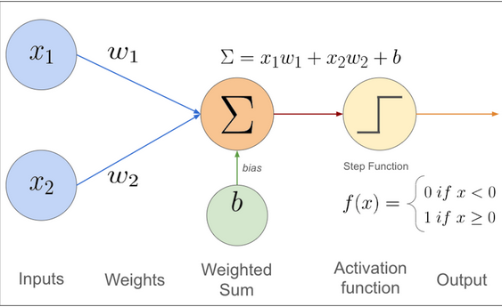
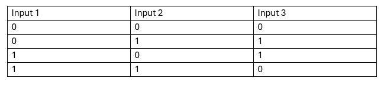
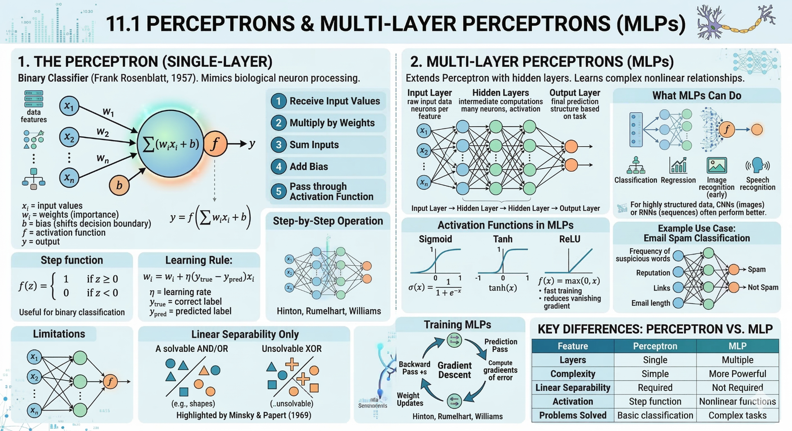

::::::::::::::::::::::::::::::::::::::: objectives
- Explain the basic idea of neurons, layers, weights, and activation's.
- Distinguish between a simple multi-layer perception and architectures
  designed for structured data such as CNNs.
- Identify when deep learning is a sensible modeling option and when it
  is not.
::::::::::::::::::::::::::::::::::::::::::::::::::

:::::::::::::::::::::::::::::::::::::::: questions
- What is a neural network in plain language?
- What makes deep learning different from a simple linear model?
- When are CNNs or other deep-learning architectures worth considering?
::::::::::::::::::::::::::::::::::::::::::::::::::

## Why introduce neural networks here?

By this point in the bootcamp, learners have already seen conventional
machine-learning baselines, training, validation, evaluation, and
feature engineering.

Neural networks are the next step when the modelling difficulty is no
longer only about choosing a classifier or regressor. Sometimes the
main difficulty is that the important structure is hard to express with
hand-crafted features.

## From a weighted sum to a neuron

A neural network starts from a simple idea.

- take the inputs (say two $x_1$ and $x_2$)
- multiply them by weights ($w_1$ and $w_2$)
- add them together, along with the bias
- pass the result through an activation function.

That combination acts like a simple computational unit, often called a
neuron.

{alt="Diagram of a simple perceptron showing inputs, weights, and an output."}
(cite:https://muneebsa.medium.com/deep-learning-101-lesson-7-perceptron-f6a698d81be8)

Diagram of a simple perceptron showing inputs, weights, and an output.
If you removed the activation function and used only a single layer,
the model would behave a lot like a linear model. The activation is
what lets the model learn more flexible nonlinear patterns.

## Why one perceptron is not enough

A single perceptron can only learn patterns that are linearly
separable. If the classes cannot be split by one straight boundary, a
single unit will not be enough.

That limitation is the reason neural networks use multiple neurons and
multiple layers. Stacking layers lets the model combine simple local
decisions into richer nonlinear behaviour.

{alt="Illustration showing a limitation of a single perceptron on a nonlinearly separable pattern."}

## From one layer to deep learning

{alt="Diagram of a multilayer perceptron with input, hidden, and output layers."}

A neural network is built by stacking many of those units into layers.
Each layer transforms the representation a little more.

- the **input layer** receives the features;
- one or more **hidden layers** transform them;
- the **output layer** produces the final prediction.

An MLP with one hidden layer is still best thought of as a neural
network. When a network has several learned hidden layers, we usually
describe it as deep learning.

The key teaching idea is not the number of layers by itself. It is that the model can build increasingly useful internal representations as data
move through the network.

## Why activations matter

{alt="Examples of common activation functions used in neural networks."}

Activation functions decide how strongly a unit responds to its input.
They matter because without them, stacking layers would still behave
like a single linear transformation.

In practice, learners do not need to memorise many activation
functions. They only need to understand the role:

- introduce nonlinearity;
- help the model represent more complex patterns;
- shape how information passes through the network.

## What training changes in a neural network

Training a neural network still follows the same high-level logic as
other models:

1. make a prediction;
2. measure the error with a loss function;
3. adjust parameters to reduce that error.

The difference is scale. Neural networks often have many more
parameters, so training means adjusting many weights across many layers.
This is why they often need more data, more compute, and more care than
conventional baselines.

At a high level, backpropagation is the mechanism that sends the error
signal backward through the network so those weights can be updated.
Learners do not need all the calculus here. The main idea is simple:
the model checks which weights contributed to the error and nudges them
to reduce it on the next pass.

## What is Backpropagation?

In deep learning, backpropagation (short for backward propagation of errors) is the core algorithm that enables a neural network to learn. It determines how much each weight and bias in the network contributed to the final error after a forward pass.

While the forward pass generates predictions and computes the loss, backpropagation works in reverse—it tells the network how to adjust its internal parameters to reduce that error in future predictions.

Rather than computing a simple difference, backpropagation operates layer by layer, moving backward through the network and using calculus to efficiently assign responsibility for the error.

**How it works**
- Propagating the Error Backward: The process begins at the output layer, where the total loss is calculated. This error signal is then propagated backward through the network, assigning each connection a measure of how much it contributed to the final error.
- The Chain Rule of Calculus: Neural networks are composed of nested mathematical functions. Backpropagation relies on the chain rule to compute gradients efficiently. The gradient of a parameter in an earlier layer is determined by multiplying gradients from all subsequent layers, revealing how small changes affect the final loss.
- Updating the Parameters: Once gradients are computed for all parameters, an optimizer (such as gradient descent) updates the weights and biases. These updates move the model toward lower loss and improved accuracy.

{alt="Illustration showing a limitation of a single perceptron on a nonlinearly separable pattern."}

## What is a Loss Function?

A loss function (also called an error or objective function) measures how far a model’s predictions are from the true values. It acts as a feedback signal that guides learning.

You can think of it as a “report card” for the model:

- A high loss means poor predictions
- A low loss (close to zero) means accurate predictions

### Common Loss Functions

Different tasks require different loss functions:

- Regression (predicting continuous values): Mean Squared Error (MSE) squares the difference between predictions and true values, heavily penalizing large errors. This makes it suitable for tasks like price prediction.
- Binary Classification (yes/no decisions): Binary Cross-Entropy (Log Loss) measures how confident the model is in predicting the correct class.
- Segmentation (predicting regions): Intersection over Union (IoU) evaluates how well predicted regions overlap with ground truth.
- Robust/Hybrid Approaches: Huber Loss combines the benefits of MSE and MAE—sensitive to small errors but more robust to outliers.

::: callout

Some evaluation metrics can also be used as loss functions, but they must be structured so that the optimal value is 0. For example, if a metric’s best value is 1, you can convert it into a loss by using:
loss = 1 − metric

:::

{alt="Illustration showing a limitation of a single perceptron on a nonlinearly separable pattern."}

## What about Gradient Descent

Gradient Descent: The Network's Mountain Guide

Gradient Descent is the main optimization algorithm used to train neural networks. If you recall our previous discussions, a loss function acts like a report card, telling the network how wrong its prediction is. But the loss function doesn't tell the network how to improve.

Gradient descent is the guide that takes that information and tells the network exactly how to adjust its internal "knobs" (the weights and biases you see being updated in our graphics) to reduce the error on the next prediction.
The Intuitive Analogy: Down the Foggy Mountain

Imagine you are standing at the top of a rugged mountain peak. Your goal is to reach the lowest possible point—the valley—where the loss is minimum (the global minimum).

The catch: You are completely blindfolded, and the entire landscape is covered in thick fog. All you can do is feel the ground beneath your feet to determine the steepest slope downwards.

Gradient Descent does this step-by-step:

- Feel the Slope: You stand in place and feel which direction slopes down most steeply.
- Take a Step: You take a single, careful step in that downward direction.
- Repeat: You repeat this process—checking the slope and taking another step—until the ground becomes flat, meaning you've reached the bottom (minimum loss).

To understand how the math works, you must understand three critical terms that form the gradient descent process:

| Concept	| The Analogy	| The Technical Meaning	| How it impacts the graphic |
| --- | --- | --- | --- |
| Loss Function (Cost) | The entire mountain range | The mathematical function measuring the prediction error. | Goal: Finding the lowest point on this surface. |
| Learning Rate (α) |	The size of your footprint/step |	A key setting (a small number like 0.01) that controls how large an adjustment is made.	| Tuning: A bad learning rate means you'll either move too slow or jump over the valley entirely. |
| Gradient | The direction and steepness of the slope |	The mathematical derivative (vector) that points uphill (steepest ascent). | Direction: Because we subtract the gradient, we move in the exact opposite direction (downhill).|

### But how does Gradient Descent update the Model?

Gradient descent operates iteratively. The model takes a batch of data, performs a Forward Pass to get predictions, and calculates the total loss. Then, it uses Backpropagation to determine the gradient for every single weight and bias in the network.

Once it has all the gradients, the optimizer (Gradient Descent) applies targeted adjustments using this simple formula:
$$
W_{new}=W_{old}−(Learning Rate×Gradient)
$$

This complex feedback loop—calculating errors, determining which internal connections caused them (backpropagation), and then slightly adjusting those connections (gradient descent)—is what allows neural networks to "learn" and become more accurate over time.

## What is a learning rate

In the process of gradient descent, which we discussed previously, the network needs to adjust its internal "knobs" (weights and biases) to minimize the error in its predictions. Backpropagation calculates the direction and magnitude (the gradient) that these weights should change.

The Learning Rate (α) is a tuning hyperparameter that controls how large a step the model takes in the opposite direction of the calculated gradient during each update cycle.

The Intuitive Analogy: Your Footprint on the Mountain

The Learning Rate (α) determines the size of your footprint. Are you taking massive, leaping jumps? Or tiny, conservative, shuffle-steps? The graphic illustrates how this setting drastically impacts your ability to converge to the true minimum.
Detailed Visualization: Tuning for the Goal

|LEARNING RATE | THE VISUAL PATH | THE OUTCOME |
| --- | --- | --- | --- |
| High (α = Large) |	Divergence / Chaotic Overshoot: The model takes a huge jump, but instead of finding the minimum, it overshoots the valley entirely and flies up the other side. This results in the loss increasing or oscillating wildly. |	Training fails. Predictions become unstable (e.g., Cat features -> Predicting DOG with high confidence). |
| Ideal (α = Optimal) |	Optimal Convergence: The model takes medium-sized, efficient steps. It balances speed with precision, finding the true global minimum quickly and settling there. |	Model learns efficiently. Predictions become highly accurate. |
| Low (α = Tiny) |	Slow Convergence / Local Trap: The model takes incredibly small steps. It may take forever to reach the bottom, making training extremely time-consuming. It also risks getting stuck in small depressions (local minima) on the path, never reaching the best possible solution. |	Training is very slow. Progress is minimal. |

::: callout

The challenge is that an ideal learning rate is hard to determine. Just like walking down a mountain, where the terrain constantly changes, it makes more sense to adapt your steps based on the conditions ahead rather than relying on a fixed approach.

:::

## The adjustable learning rate

Learning rate schedulers are techniques used during training to adjust the learning rate over time instead of keeping it constant.

Like: 
- Step Decay: Reduces the learning rate by a fixed factor after a set number of epochs.
- Exponential Decay: Continuously decreases the learning rate at an exponential rate.
- Cosine Annealing: Gradually decreases the learning rate following a cosine curve.

{alt="Diagram of a multilayer perceptron with input, hidden, and output layers."}

## The Optimizer

There is also a component called an optimizer, which defines how a model actually learns by updating its weights and biases during training. After the model makes a prediction and the loss is calculated, the optimizer uses the gradients (from backpropagation) to adjust the parameters in a way that reduces the error.

In other words, the optimizer is responsible for turning information (gradients) into action (weight updates).

There are several different types of optimizers, each with its own strategy for improving learning efficiency, stability, and speed.

Common Optimizers

- Gradient Descent: The most basic approach, which computes updates using the entire dataset. While simple, it can be slow and computationally expensive.
- Stochastic Gradient Descent (SGD): Updates weights using small batches of data instead of the full dataset. This makes training faster and introduces some randomness, which can help escape local minima.
- Adam (Adaptive Moment Estimation): An advanced optimizer that adapts the learning rate for each parameter by combining momentum (direction of past gradients) with scaling (magnitude of gradients). It is widely used due to its strong performance in practice.
- RMSprop: Adjusts learning rates based on recent gradients, helping stabilize training—especially useful in problems with noisy or changing gradients.

{alt="Diagram of a multilayer perceptron with input, hidden, and output layers."}

### In Summary

The optimizer is the mechanism that takes everything computed during training—predictions, loss, and gradients—and actually applies it to update the model. Without it, the model would not improve, as no learning would take place.

## Common neural-network families

Not all neural networks are the same. Different data structures often
call for different architecture families.

| Data type | Common architecture | Why |
| --- | --- | --- |
| Tabular | MLP | Works on fixed-length numeric feature vectors |
| Images | CNN or vision transformer | Preserves spatial structure |
| Text | Sequence model or transformer | Captures order and context |
| Time series | 1D CNN, recurrent model, or transformer | Captures temporal structure |
| Signals / spectra | 1D CNN or feature-based hybrid | Detects local patterns across a sequence |

## Summary

{alt="Schematic embedding space showing biology and space related texts forming separate regions, with a new example placed near its semantically similar neighbours."}

## Available demo notebook

One demo notebook is available for this lesson.

- [MLP_and_NNs.ipynb](files/notebooks/MLP_and_NNs.ipynb):
  Explores creating an MLP and NN for both classification and regression problem in the iris dataset

## Key points

:::::::::::::::::::::::::::::::::::::::: keypoints
- A neural network is built from weighted transformations and
  activation functions arranged in layers.
- Deep learning means learning increasingly useful internal
  representations across multiple layers.
- Different data types suggest different architecture families.
- CNNs are especially useful when local spatial or sequential patterns
  matter.
- Deep learning should be justified by the structure of the data and
  the limits of simpler models.

- Does PCA count as representation learning?
- In what sense is it similar to learned embeddings?
- In what sense is it different from neural-network-based
  representation learning?
::::::::::::::::::::::::::::::::::::::::::::::::::

