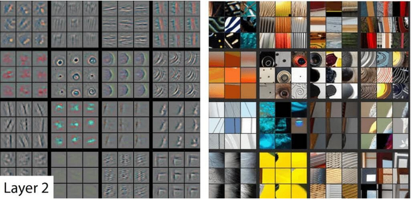
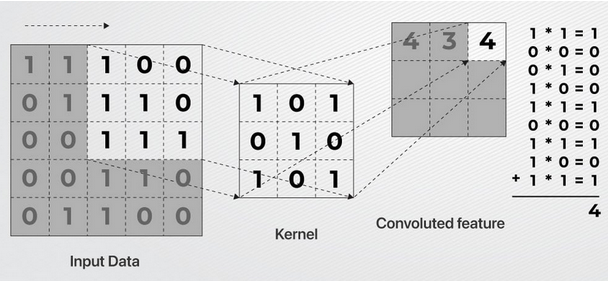
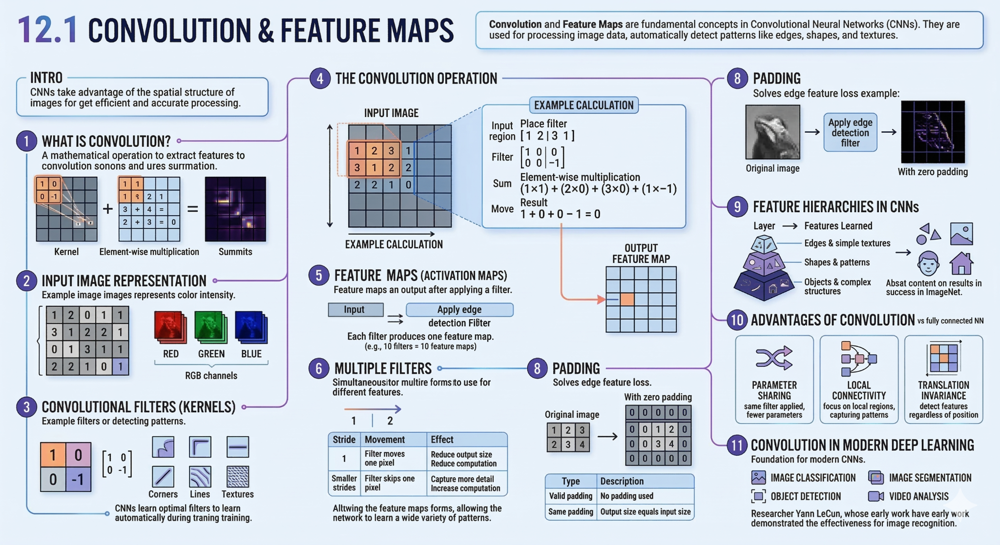
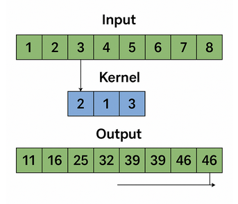
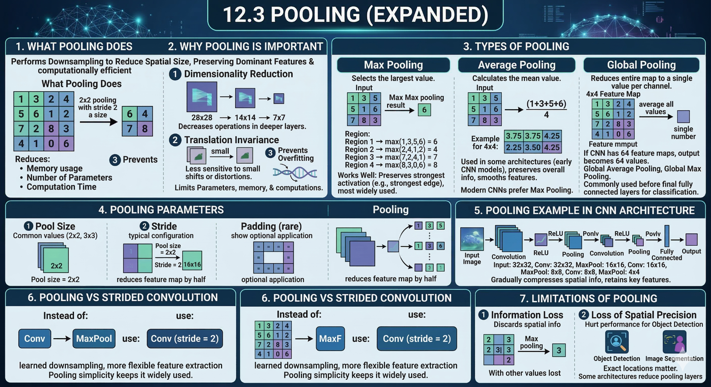

::::::::::::::::::::::::::::::::::::::: objectives

- Define both a trivial reference baseline and a practical model
  basket.
- Choose an initial model based on task type, data shape,
  interpretability, and time available.
- Distinguish between a first baseline model and a stronger comparison
  model.
  
::::::::::::::::::::::::::::::::::::::::::::::::::

:::::::::::::::::::::::::::::::::::::::: questions

- What counts as a sensible baseline or comparison model?
- Which conventional models belong in my starter model basket?

::::::::::::::::::::::::::::::::::::::::::::::::::

## Convolutional neural networks

A convolutional neural network, or CNN, is designed for grid-like data
such as images.

Instead of treating every pixel independently, a CNN scans small
filters across the input. This lets the model detect local patterns
such as edges, textures, and shapes.

Why this matters
- Spatial relationships: Nearby pixels in an image are often related
- Translation invariance: The same pattern (e.g., an edge or object) can appear anywhere in the image
- Efficiency: Reusing small filters avoids relearning the same features across the entire image

Because of these properties, CNNs became the foundation of modern computer vision systems.

That is why CNNs became such an important model family for vision.

## How a CNN works

The core building block of a CNN is the convolutional layer.

- A small matrix called a filter (or kernel) slides across the input
- At each position, it performs element-wise multiplication with the input values
- The results are summed to produce a single value
- Repeating this process creates a feature map

A feature map highlights where certain patterns appear in the input.

{alt="Diagram showing how an image is represented as pixel values."}

### What the network learns
- Early layers detect simple features (edges, lines, textures)
- Deeper layers combine these into complex patterns (shapes, objects)

{alt="Example feature maps created by different convolutional kernels."}

At the start of training, filters are random. Through backpropagation and optimization, the network learns which patterns are useful and adjusts the filter values accordingly.

At the start of training, the kernel values are not meaningful. The
model learns them from data by adjusting them during training.

## 2D convolutions in vision

For image tasks, CNNs typically use 2D convolutions.

- The kernel is a small window (e.g., 3×3 or 5×5)
- It moves across the height and width of the image
- Each pass produces a feature map

This allows the network to:

- Detect local features regardless of their position
- Build hierarchical representations (from edges → shapes → objects)

{alt="Diagram showing a convolutional kernel sliding across an image."}

{alt="Diagram showing how an image is represented as pixel values."}

::: callout
CNNs learn reusable local pattern detectors and stack them to form increasingly abstract representations.
:::

{alt="Example feature maps created by different convolutional kernels."}

## 1D convolutions for sequences and signals

{alt="Diagram showing a one-dimensional convolution scanning across a sequence."}

Convolutions are not limited to images. A 1D convolution operates over sequences instead of 2D grids.

Instead of sliding a 2D window, it slides along a single dimension.

Common use cases
- Time series data (e.g., stock prices, sensor readings)
- Audio and signal processing
- Spectral data
- Biological sequences (e.g., DNA)

### Why it works

The intuition is the same as with images:

The model learns short local patterns
These patterns are reused across the sequence

This makes 1D convolutions more effective than simply flattening the data, which would ignore local structure and relationships.

## The other layers

CNNs don’t consist only of convolutional layers. They also include other types of layers that serve specific roles in helping the model learn and make predictions.

**Pooling Layers (Downsampling)**

Pooling layers reduce the spatial size of feature maps, which makes computation more efficient and helps the network focus on the most important features.

They also make the model more robust to small spatial changes, meaning it becomes less sensitive to the exact position of an object in an image.

{alt="Example feature maps created by different convolutional kernels."}

**Fully Connected Layers (Dense Layers)**

Fully connected (dense) layers are the standard type of neural network layer where every neuron in one layer is connected to every neuron in the next.

These layers typically appear at the end of a CNN and are responsible for:

- Combining the extracted features
- Making the final prediction (e.g., classification or regression)

They act as the decision-making part of the network, taking the high-level features learned by the convolutional layers and turning them into an output.

Here is a polished and professionally formatted version of your summary. I’ve cleaned up the grammar, tightened the phrasing, and organized the comparison into a clear table to make the "division of labor" between these layers really pop.
Putting It All Together

By combining the layers just mentioned with the convolutional foundations discussed earlier, you create a powerful two-phase architecture. In this setup, the Convolutional layers act as the "eyes" of the model (feature extraction), while the Dense layers act as the "brain" (final decision-making).

This standard architecture utilizes two distinct types of connectivity, which is why we conceptually separate the "convolutional" stage from the "standard neural network" stage:

|Feature | Phase 1: CNN (Feature Extraction) |	Phase 2: Standard NN (Classification Head) |
|---|---|---|
| Layer Type |	Convolution, Pooling |	Fully Connected (Dense) |
| Connectivity |	Local Connectivity: Each neuron only "sees" a small window (the filter size).	| Fully Connected: Every neuron connects to every single neuron in the next layer. |
| Efficiency |	High Efficiency: Uses "Weight Sharing" where one filter scans the entire image.	| Low Efficiency: Parameters explode as the input grows (often millions of weights). |
| Data Structure	| Operates on 2D grids / 3D volumes to preserve spatial relationships. |	Operates on 1D feature vectors, effectively ignoring spatial location. |
| Function	Learns what and where visual features (edges, patterns, objects) exist. |	Interprets global features to make a high-level decision (e.g., "This is a cat"). |

## Summary

{alt="Diagram showing a one-dimensional convolution scanning across a sequence."}

::: callout
Lastly, there are additional layers required for the construction in a neural network
{alt="Diagram showing a one-dimensional convolution scanning across a sequence."}

:::

## Key points

:::::::::::::::::::::::::::::::::::::::: keypoints
- Choose the task type before choosing the algorithm.
- A good starter model basket includes both simple baselines and one or
  two stronger comparison options.
- Conventional models are usually the right first step for structured
  or limited data.
- Stronger models should be added for a reason, not because they sound
  more advanced.
::::::::::::::::::::::::::::::::::::::::::::::::::
