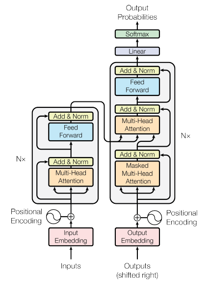

::::::::::::::::::::::::::::::::::::::: objectives

- Define both a trivial reference baseline and a practical model
  basket.
- Choose an initial model based on task type, data shape,
  interpretability, and time available.
- Distinguish between a first baseline model and a stronger comparison
  model.
  
::::::::::::::::::::::::::::::::::::::::::::::::::

:::::::::::::::::::::::::::::::::::::::: questions

- What counts as a sensible baseline or comparison model?
- Which conventional models belong in my starter model basket?

::::::::::::::::::::::::::::::::::::::::::::::::::

## Transformer Deep Learning Models

### Introduction

Transformers are a type of deep learning architecture designed primarily for handling sequential data such as text, audio, and time series. They power many modern AI systems, including language models, translation systems, and chatbots.

Instead of processing data step-by-step like RNNs or LSTMs, transformers process entire sequences in parallel using a mechanism called attention.

## The Core Philosophy: Parallelism & Context

Before 2017, AI processed language like a human reading a book: one word at a time, from left to right (using RNNs or LSTMs). This was slow and often "forgot" the beginning of a long sentence by the time it reached the end.

The Transformer changed this by processing the entire sentence at once. It doesn't care about the order initially; instead, it uses "Attention" to see how every word relates to every other word simultaneously.
Key Advantages:

- Parallelization: Because it sees everything at once, we can train it on massive GPUs much faster.
- Long-Range Dependencies: It can easily link a word at the beginning of a 1,000-page book to a word at the very end.

Step 0: Tokenisation & Embedding

Computers don't read words; they read numbers.

- Tokenization: The sentence "The cat sat" is broken into chunks (tokens): ["The", " cat", " sat"].
- Embedding: Each token is converted into a long list of numbers (a vector) that represents its meaning. In this space, the vector for "cat" is mathematically close to "kitten" but far from "airplane."

### Step 1: Positional Encoding (The "Map")

Since the model processes all words at once, it loses the sense of order. To fix this, we add a "Position Signal" to the embeddings.

- Classic Method: Sinusoidal waves (sine/cosine).
- Modern 2026 Standard: RoPE (Rotary Positional Embeddings), which rotates the vectors in a way that helps the model understand relative distances between words more naturally.

### Step 2: Self-Attention (The "Spotlight")

This is the "secret sauce." For every word, the model asks: "Which other words in this sentence help me understand this specific word better?"

It uses three vectors for each token:

- Query (Q): What am I looking for? (The "Question")
- Key (K): What do I contain? (The "Label")
- Value (V): What information do I actually hold? (The "Content")
- Example: In the sentence "The animal didn't cross the street because it was too tired," the word "it" sends out a Query. The Key for "animal" matches that Query strongly, so the model "attends" to "animal" to understand what "it" refers to.

### Step 3: Multi-Head Attention

Instead of looking at the sentence once, the model does it many times in parallel (Heads).

- Head 1 might focus on grammar.
- Head 2 might focus on pronouns.
- Head 3 might focus on the relationship between objects and actions.
- All these perspectives are then merged back together.

### Step 4: Feed-Forward & Normalization

After attention, the data passes through a standard neural network (Feed-Forward) to refine the features.

- Add & Norm: We use "Residual Connections" (shortcuts) to make sure information doesn't get lost as the model gets deeper.
- Modern Note: Most 2026 models use Pre-Norm (normalizing before the layer) for better stability during training.

{alt="Schematic embedding space showing biology and space related texts forming separate regions, with a new example placed near its semantically similar neighbours."}

{alt="Schematic embedding space showing biology and space related texts forming separate regions, with a new example placed near its semantically similar neighbours."}

## Key points

:::::::::::::::::::::::::::::::::::::::: keypoints
- Choose the task type before choosing the algorithm.
- A good starter model basket includes both simple baselines and one or
  two stronger comparison options.
- Conventional models are usually the right first step for structured
  or limited data.
- Stronger models should be added for a reason, not because they sound
  more advanced.
::::::::::::::::::::::::::::::::::::::::::::::::::
