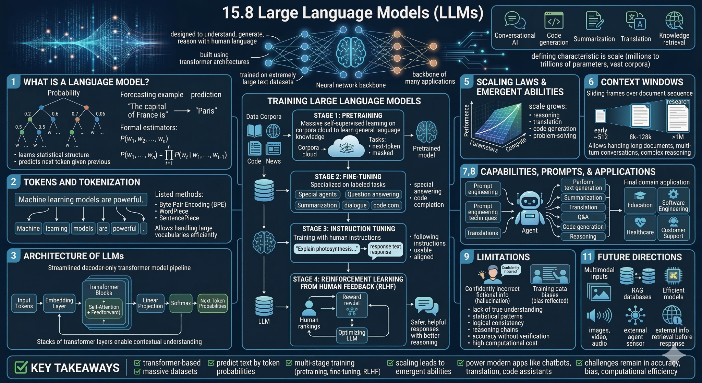

::::::::::::::::::::::::::::::::::::::: objectives

- Understand what Large Language Models (LLMs) are and how they work
- Explain how language models generate text using probabilities
- Describe tokenization and its role in processing language
- Recognize the architecture behind modern LLMs
  
::::::::::::::::::::::::::::::::::::::::::::::::::

:::::::::::::::::::::::::::::::::::::::: questions

- What does a language model actually predict?
- Why is tokenization necessary for LLMs?
- How does a decoder-only transformer generate text?
- What role does self-attention play in LLMs?
- Why are LLMs considered “large”?

::::::::::::::::::::::::::::::::::::::::::::::::::

## Large Language Models (LLMs)

Large Language Models (LLMs) are AI systems built on the Transformer architecture that understand and generate human language. They are trained on massive datasets and power applications like chatbots, code generation, summarization, and translation. Their key feature is scale, with billions or more parameters.

### 1. Language Models

A language model estimates the probability of a token sequence:

$$
P(w_1, ..., w_n) = \prod_{t=1}^{n} P(w_t \mid w_1, ..., w_{t-1})
$$

It predicts the next token based on previous ones, enabling text generation.

### 2. Tokens and Tokenization

Text is converted into tokens (words or subwords). Methods like BPE, WordPiece, and SentencePiece allow efficient handling of large vocabularies.

## 3. Architecture

Most LLMs use decoder-only transformers:

Input → Embeddings → Transformer layers (self-attention) → Output probabilities

self-attention enables models to capture context across tokens.

### 4. Training

Training occurs in stages:

- **Pretraining:** Learn general language patterns  
- **Fine-tuning:** Adapt to specific tasks  
- **Instruction tuning:** Improve responses to prompts  
- **RLHF:** Align outputs with human preferences  

---

### 5. Scaling Laws

Performance improves with more parameters, data, and compute. Larger models can show emergent abilities like reasoning and code generation.

---

### 6. Context Windows

Defines how many tokens a model can process at once, affecting handling of long inputs.

---

### 7. Capabilities

- Text generation  
- Summarization  
- Translation  
- Question answering  
- Code generation  
- Reasoning  

---

### 8. Prompt Engineering

Careful prompt design improves accuracy, style, and depth.

---

### 9. Limitations

- Hallucinations  
- Bias  
- High computational cost  
- Limited true understanding  

---

### 10. Applications

Used in education, software, healthcare, business, and customer support.

---

### 11. Future Directions

- Multimodal models  
- Retrieval-Augmented Generation (RAG)  
- Efficient models (quantization, distillation)  
- Agentic systems  
{alt="Diagram showing a one-dimensional convolution scanning across a sequence."}

One demo notebooks are available for this lesson.

- [Google_gemini.ipynb](files/notebooks/Google_gemini.ipynb):
  explores how to connect to google gemini in python.
  

:::::::::::::::::::::::::::::::::::::::: keypoints
- LLMs are built on Transformer architectures and trained at massive scale
- Core idea: predict the next token given previous tokens
- Language modelling is based on probability of sequences
- Tokenization breaks text into manageable units: word-level or subword-level (BPE, WordPiece, SentencePiece)
- Most LLMs use decoder-only transformers: embeddings → self-attention → output probabilities
- Self-attention enables context-aware predictions across tokens
::::::::::::::::::::::::::::::::::::::::::::::::::
