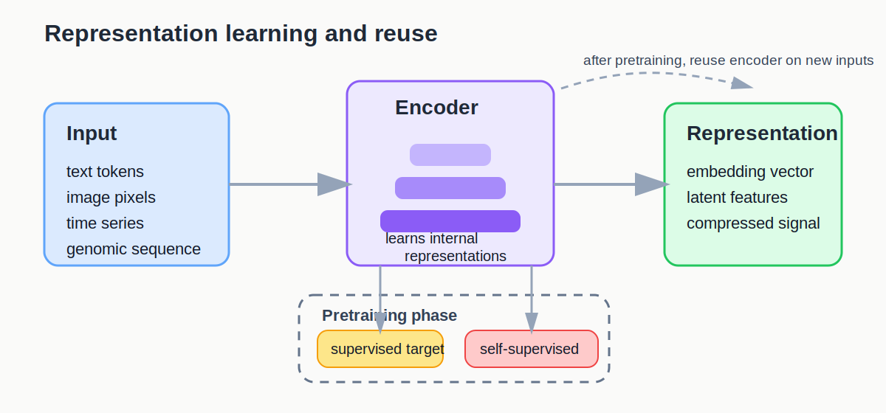
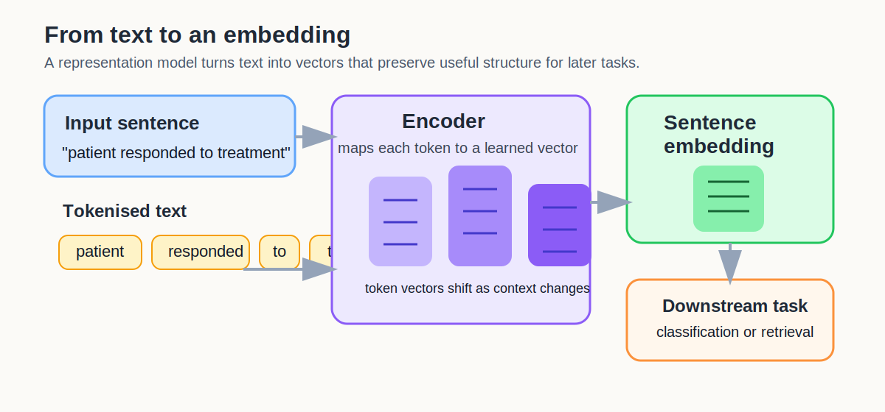
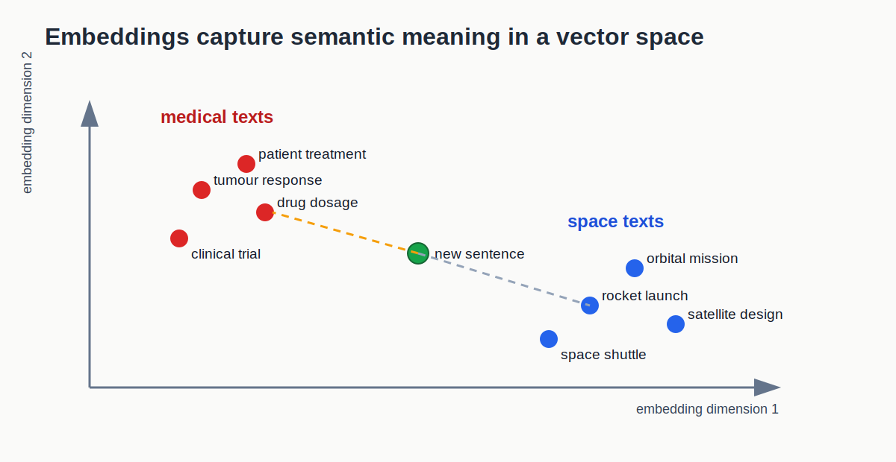

::::::::::::::::::::::::::::::::::::::: objectives
- Explain feature learning in plain language.
- Distinguish between conventional feature engineering and learned
  representations.
- Identify cases where transfer learning or specialised architectures
  are a more realistic next step than training a deep model from
  scratch.
::::::::::::::::::::::::::::::::::::::::::::::::::

:::::::::::::::::::::::::::::::::::::::: questions
- What does it mean for a model to learn features automatically?
- When is transfer learning more realistic than training from scratch?
- How should representation and data type guide the next modelling step?
::::::::::::::::::::::::::::::::::::::::::::::::::

## From engineered features to learned representations

In conventional machine learning, people usually decide which features
the model should use. In feature learning, the model learns internal
representations automatically from the training data.

This page is about what you do with that idea in practice, especially
when you do not want to train a large deep model from scratch.

Learned representations can arise in more than one way:

- in **supervised learning**, the internal features are shaped by a task
  label such as a class or target value;
- in **self-supervised learning**, the model learns useful internal
  structure from the input itself, for example by predicting masked or
  missing parts.

{alt="Diagram showing raw inputs transformed by an encoder into learned representations, trained through supervised or self-supervised objectives."}

One useful plain-language definition is this: a representation is a way
of transforming your data into a feature vector space where the
patterns you care about become easier to separate, compare, or
retrieve.

For text, that raises an important question: what exactly is being
represented?

- a **word embedding** gives one learned vector per vocabulary item;
- a **token embedding** gives a vector for a word as it appears in a
  particular context;
- a **sentence embedding** gives one vector for the whole sentence or
  short document.

For this lesson, the most useful visual is the sentence-embedding view,
because that is the pattern used in the text demo notebook.

## A text to embedding example

An embedding model changes the problem. Instead of counting only visible
tokens, it learns vectors that summarise how pieces of text behave
across many examples.

{alt="Diagram showing a sentence tokenised, mapped into token vectors by an encoder, then combined into one sentence embedding for a downstream task."}

This is why embeddings are often described as learned representations:
the model has learned a reusable way to encode inputs before the final
classifier sees them.

## Why the embedding can be meaningful

The key idea is not that the vector itself is magical. The key idea is
that training pushes similar inputs toward similar internal
representations.

For example, a useful text embedding should tend to place medically
related sentences nearer each other than to space-related sentences,
even if the wording is not identical.

{alt="Schematic embedding space showing biology and space related texts forming separate regions, with a new example placed near its semantically similar neighbours."}

This drawing is only a sketch. Real embeddings may have hundreds of
dimensions, and we usually inspect them only after projection. The
important point is the geometry: closeness in representation space can
correspond to semantic similarity or task-relevant similarity.

That is exactly what makes transfer learning practical. If a pre-trained
encoder already places related inputs in sensible regions of the space,
you can often train a much simpler downstream model on top.

## When deep learning can help

Deep learning can be a good next step when:

- the data are unstructured or highly structured in raw form;
- important patterns are hard to hand-design as features;
- there is enough data, compute, or a strong pre-trained starting
  point;
- the data type naturally suggests a specialist architecture.

## When deep learning is not the right next step

Deep learning is not automatically better.

- it is often harder to interpret;
- it can be slower to train and debug;
- it may need far more data than a workshop project has;
- it is easy to add complexity without adding insight.

That is why conventional baselines still matter. They tell you whether
the extra complexity is justified.

## Why transfer learning matters in practice

Most bootcamp projects do not have the data, time, or compute needed to
train a large deep model well from scratch. That is why transfer
learning is often the more realistic route.

Instead of learning everything from the beginning, you reuse a model or
encoder that has already learned a useful representation somewhere else.

## Transfer learning

Many workshop projects do not have enough data to train a deep model
from scratch. In those cases, transfer learning is often the realistic
option.

Transfer learning means starting from a model that has already learned a
useful representation on a larger dataset, then adapting that learned
representation to a new task.

Examples:

- sentence embeddings for text classification;
- pre-trained image models for vision tasks;
- pre-trained sequence encoders for genomic or protein sequences;
- pre-trained encoders for spectroscopy or multi-spectral signals such
  as NIRS when those data are treated as structured spectra or temporal
  signals.

## Common transfer-learning patterns

There are several practical ways to use a pre-trained representation.

- use the encoder only and train a simpler downstream model on top;
- fine-tune part of the pre-trained model for the new task;
- compare a frozen feature extractor against a fully trainable model if
  you have enough data.

For workshop-scale projects, the first option is often the safest.

## Matching transfer learning to the data

The question here is less about the architecture family itself and more
about what kind of pre-trained representation is available.

| Data type | Useful transfer-learning direction |
| --- | --- |
| Text | sentence embeddings, transformer encoders |
| Vision | pre-trained image encoders, transfer features |
| Time series / signals | pre-trained sequence encoders when available |
| Spectra / specialist scientific data | domain-specific encoders or extracted embeddings |
| Tabular | usually better feature engineering first |

## Available demo notebooks

Two demo notebooks are available for this lesson.

- [demo_transfer_learning_vision.ipynb](files/notebooks/demo_transfer_learning_vision.ipynb):
  compares a weak raw-pixel baseline with features from a pre-trained
  image model.
- [demo_transfer_learning_text.ipynb](files/notebooks/demo_transfer_learning_text.ipynb):
  compares TF-IDF plus logistic regression with sentence embeddings plus
  logistic regression.

That combination gives a strong cross-task story without making the
lesson too abstract.

## A practical decision rule

Ask these questions in order:

1. Can a conventional model with sensible features solve enough of the
   problem?
2. If not, is the limitation mainly about representation rather than the
   choice of classifier or regressor?
3. If yes, is there a pre-trained representation or architecture that
   matches this data type?

If the answer to the third question is yes, transfer learning or a
representation-learning approach may be the right next step.

:::::::::::::::::::::::::::::::::::::::  challenge
### Which route fits your data?

For your own project, write down:

- what kind of data structure you have;
- whether a simple feature table is enough to represent it;
- whether the next step should be better feature engineering, a
  specialist deep-learning architecture, or transfer learning.
::::::::::::::::::::::::::::::::::::::::::::::::::

:::::::::::::::::::::::::::::::::::::::  challenge
### Feature engineering or feature learning?

For your own project, answer:

- What representation are you currently using?
- What important structure might it be missing?
- Would that gap be better addressed by a hand-crafted feature or by a
  learned representation?
::::::::::::::::::::::::::::::::::::::::::::::::::

## Is PCA representation learning?

PCA creates a lower-dimensional representation of the data, so it does
learn a new representation in a broad sense. However, it is usually not
what people mean by deep representation learning because:

- it is linear rather than highly expressive;
- it does not learn layered features through a neural network;
- it is usually unsupervised dimensionality reduction rather than deep
  feature learning.

:::::::::::::::::::::::::::::::::::::::  challenge
### Comparing PCA with learned embeddings

Discuss with a partner:

- In what sense is it similar to learned embeddings?
- In what sense is it different from neural-network-based
  representation learning?
::::::::::::::::::::::::::::::::::::::::::::::::::

## Key points

:::::::::::::::::::::::::::::::::::::::: keypoints
- Feature learning means the model learns useful internal
  representations rather than relying only on hand-crafted features.
- Transfer learning is usually more realistic than training from
  scratch for workshop-scale projects.
- Transfer learning is about reusing a representation that has already
  been learned elsewhere.
- The most practical question is often not "should I use deep learning?"
  but "is there a useful pre-trained representation for my data type?"
- Conventional baselines still matter because they tell you whether the
  extra complexity is justified.
::::::::::::::::::::::::::::::::::::::::::::::::::
